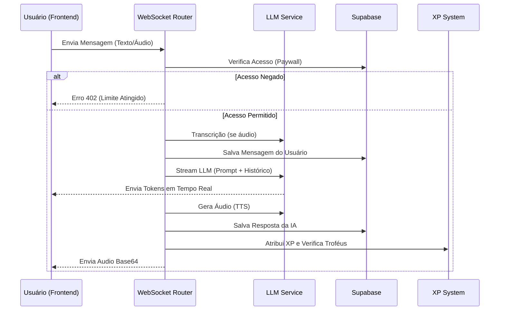

# 📘 Documentação Técnica - Teacher Tati

Este documento fornece detalhes técnicos aprofundados sobre o funcionamento interno da plataforma Teacher Tati.

---

## 🏗️ Arquitetura de Software

### 1. Camada de IA e Rotação de Chaves (Key Rotation)
Para garantir alta disponibilidade e contornar os limites de taxa (Rate Limits) do Groq e ElevenLabs, o sistema implementa um `Key Rotator` simples no arquivo `backend/services/llm.py`.

- **Lógica:** O sistema tenta realizar a chamada com a primeira chave definida no `.env`. Caso receba um erro de autenticação (401) ou limite de taxa (429), ele automaticamente pula para a próxima chave disponível.
- **Provedores Suportados:** Groq (Llama 3), Anthropic (Claude), Google (Gemini) e OpenAI.

### 2. Ciclo de Vida do Chat (WebSocket)
O fluxo de mensagens via WebSocket no `backend/routers/ai/chat.py` é o coração do sistema:

---

## 🎮 Gamificação e Progresso

### Cálculo de Nível (CEFR)
O sistema utiliza o `xp_system.py` para mapear o XP total em níveis de proficiência:

| Nível | XP Mínimo | Descrição |
|-------|-----------|-----------|
| A1    | 0         | Beginner  |
| A2    | 500       | Elementary |
| B1    | 1200      | Intermediate |
| B2    | 2500      | Upper Intermediate |
| C1    | 4000      | Advanced |
| C2    | 6000      | Mastery |

### Eventos de XP
- **Mensagem enviada:** +10 XP
- **Resposta correta em Quiz:** +25 XP
- **Nova palavra no vocabulário:** +15 XP
- **Simulação completa:** +50 XP

---

## 💰 Sistema de Pagamentos e Acesso

### Lógica de Grace Period (Carência)
Implementada no `chat.py`, permite que o usuário continue acessando o sistema por até **5 dias úteis** após o vencimento da assinatura, garantindo uma melhor experiência durante o processamento de boletos ou renovações.

### Webhooks Asaas
O endpoint `backend/routers/payments/asaas.py` processa eventos assíncronos:
- `PAYMENT_CONFIRMED`: Ativa a flag `is_premium_active` e define a data de expiração.
- `PAYMENT_OVERDUE`: Inicia o período de carência.
- `PAYMENT_DELETED`: Remove o acesso premium.

---

## 🗄️ Esquema de Banco de Dados (Principais Tabelas)

- **users:** Armazena dados de perfil, credenciais e JSONB de XP/Streaks.
- **messages:** Histórico completo de conversas, incluindo referências a áudio.
- **trophies:** Definição estática de conquistas.
- **user_trophies:** Relacionamento N:N entre usuários e conquistas.
- **subscriptions:** Controle de planos e vigência.
- **modules/quizzes:** Conteúdo pedagógico gerido via Admin.

---

## 🛠️ Manutenção e Extensão

### Adicionando um novo Provedor de LLM
1. Adicione a chave no `core/config.py`.
2. Implemente a função de chamada no `services/llm.py`.
3. Atualize a lógica de fallback no `stream_llm`.

### Criando novos Troféus
Os troféus são verificados no `services/trophy_service.py`. Para adicionar uma nova conquista, insira-a na tabela `trophies` e adicione a lógica de gatilho (trigger) na função correspondente do serviço.
