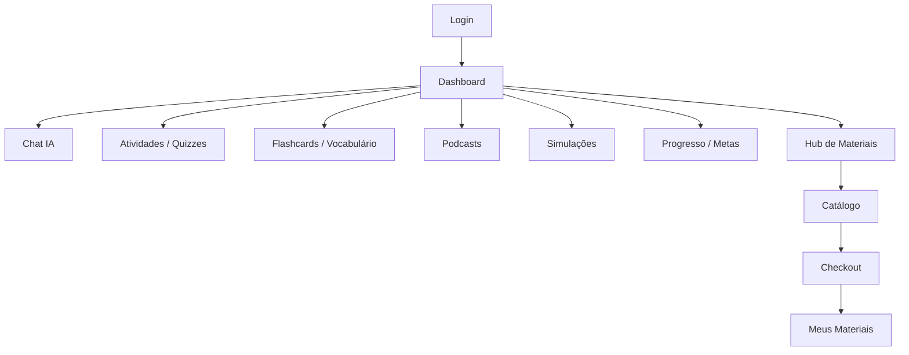
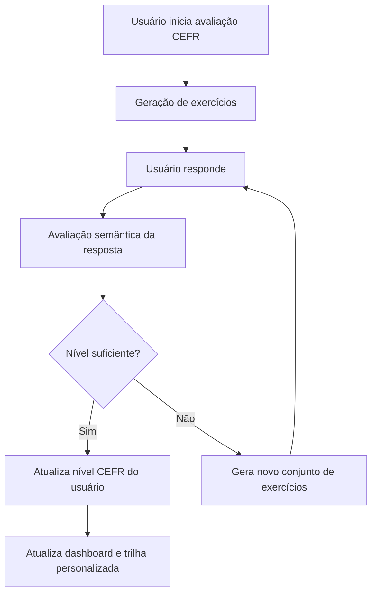
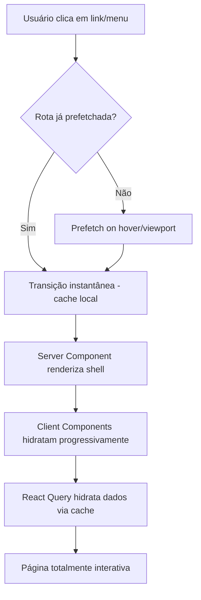
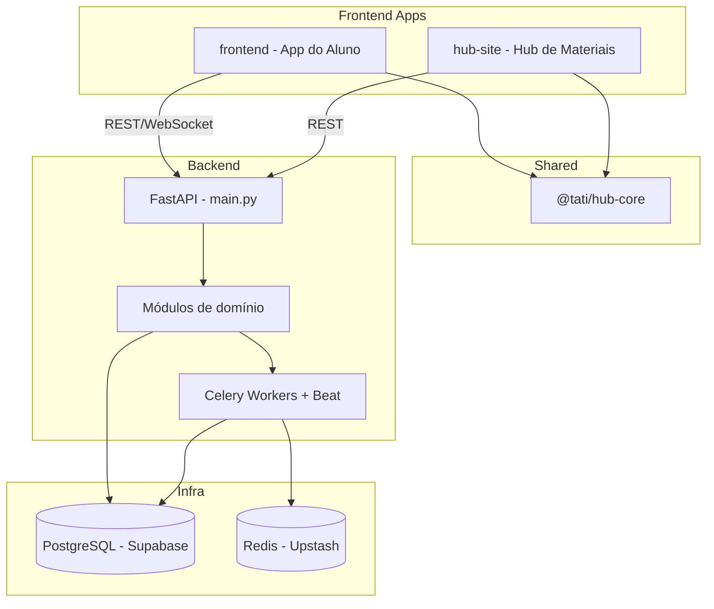
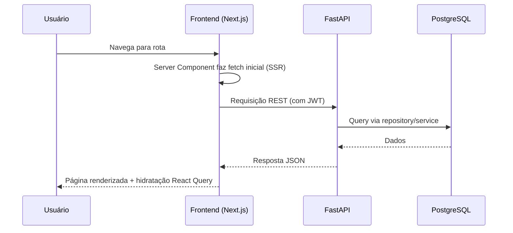
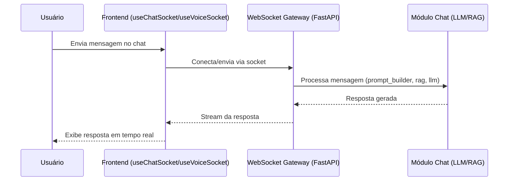
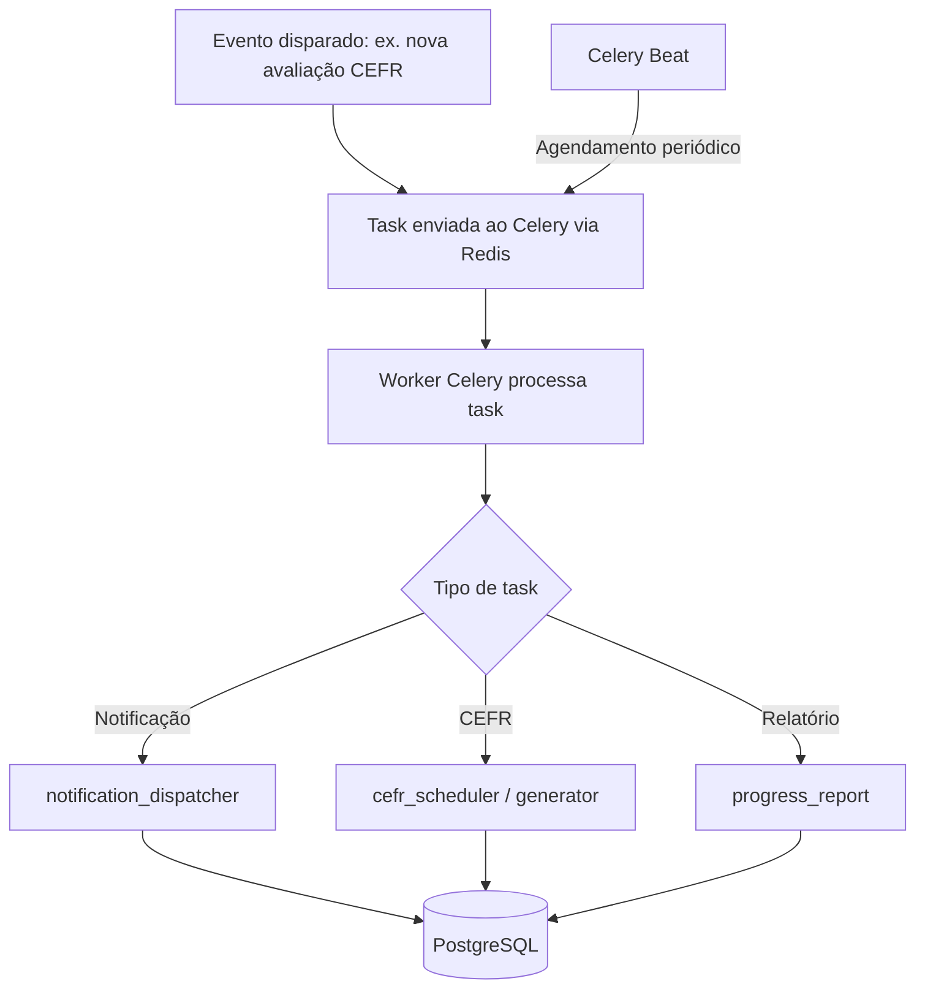
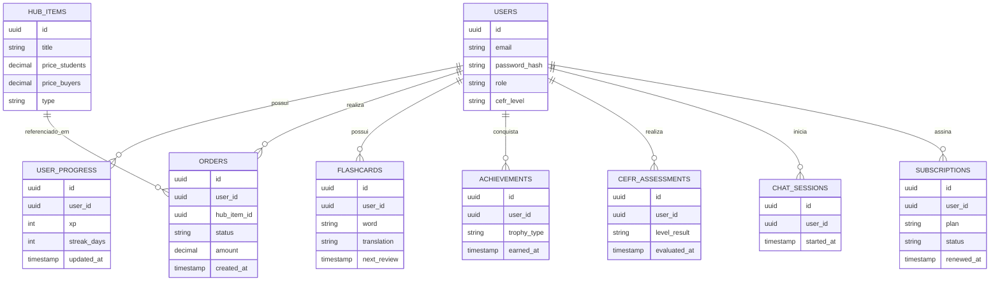

# PRD – Tati AI

## 1. Visão Geral

### Contexto do produto
Tati AI é uma plataforma full stack de aprendizado de inglês com IA, composta por um app principal do aluno (Next.js 14), um hub de materiais (Next.js), uma API backend (FastAPI), processamento assíncrono (Celery + Redis) e persistência em PostgreSQL via Supabase. A plataforma é organizada como monorepo, com um pacote compartilhado (`hub-core`) entre os frontends.

### Problema que está sendo resolvido
Usuários percebem atrasos perceptíveis ao navegar entre páginas (clique em link/menu até a renderização da nova rota). Isso prejudica a percepção de qualidade, aumenta a taxa de abandono e reduz o engajamento com atividades, chat e gamificação – funcionalidades que dependem de transições fluidas para manter o fluxo de estudo do aluno.

### Estado atual da plataforma
A maior parte das funcionalidades-chave já está implementada e operacional: autenticação, dashboard, chat com IA, avaliação CEFR, flashcards, vocabulário, gamificação, podcasts, simulações de conversação, pagamentos (Asaas/MercadoPago), hub de materiais e notificações. A infraestrutura de deploy (Railway para API, Vercel para frontends, Supabase para banco) está ativa. Persistem gargalos de performance no frontend, principalmente relacionados a navegação entre rotas, hidratação, carregamento de bibliotecas pesadas e padrões de fetch/cache.

### Escopo do documento
Este PRD cobre (1) diagnóstico e plano de otimização da navegação/performance do frontend como prioridade máxima (Sprint 0), e (2) a visão de produto, requisitos funcionais/não funcionais, arquitetura técnica, user stories, métricas e roadmap evolutivo das próximas fases da plataforma.

---

## 2. Sobre o Produto

### Descrição da plataforma
Tati AI é um ecossistema de aprendizado de inglês orientado por IA, que combina trilhas personalizadas, prática conversacional com avatar/IA, avaliação contínua de nível (CEFR), gamificação (XP, troféus, rankings, desafios) e um hub de materiais educacionais comercializáveis para alunos e compradores externos.

### Diferenciais
- Tutor de IA conversacional (Tati) com RAG e julgamento semântico de respostas.
- Avaliação automática de nível CEFR com geração dinâmica de conteúdo.
- Gamificação completa (XP, streaks, troféus, rankings, competições).
- Simulações de conversação com avatar.
- Hub de materiais com precificação diferenciada por papel (aluno vs. comprador).
- Suporte multiplataforma: web, PWA, mobile (Capacitor) e desktop (planejado via Tauri).

### Principais funcionalidades
- Autenticação e perfis de usuário.
- Dashboard de progresso e metas.
- Chat com IA (texto e voz, via WebSocket).
- Avaliação e progressão CEFR.
- Flashcards e SRS de vocabulário.
- Quizzes, desafios e atividades personalizadas.
- Podcasts com exercícios derivados.
- Simulações de conversação com avatar.
- Sistema de pagamentos e assinaturas.
- Hub de materiais (compra, acesso seguro a documentos, catálogo).
- Notificações push e relatórios diários/semanais.

---

## 3. Propósito

### Objetivo de negócio
Aumentar a retenção e a conversão de alunos para planos premium e produtos do hub, reduzindo atrito na experiência de uso – começando pela eliminação de lentidão perceptível na navegação, que impacta diretamente a percepção de qualidade do produto.

### Objetivo educacional
Oferecer uma jornada de aprendizado de inglês personalizada, adaptativa e gamificada, que mantenha o aluno engajado por meio de feedback rápido, prática constante e progressão visível de nível (CEFR).

### Objetivo tecnológico
Consolidar uma arquitetura frontend performática (Next.js 14 App Router) com navegação quase instantânea, aproveitando corretamente Server Components, prefetch, cache do React Query, code-splitting e streaming/Suspense, sem introduzir over-engineering.

---

## 4. Público-Alvo

### Alunos iniciantes
Usuários com nível CEFR A1–A2, que precisam de interfaces simples, feedback imediato e baixa carga cognitiva. Sensíveis a lentidão, pois desistem facilmente diante de fricção.

### Alunos intermediários
Usuários CEFR B1–B2, que utilizam mais intensamente chat, flashcards, simulações e atividades personalizadas. Navegam entre várias seções na mesma sessão de estudo.

### Alunos avançados
Usuários CEFR C1–C2, focados em desafios, podcasts e simulações avançadas, com maior expectativa de fluidez e velocidade na plataforma.

### Professores
Usuários que acessam o Hub de materiais para publicar, gerenciar e revisar conteúdos educacionais.

### Administradores
Usuários com acesso ao painel administrativo, responsáveis por dashboards de alunos/compradores, gestão de planos, preços e monitoramento de tarefas assíncronas.

---

## 5. Objetivos

### Curto prazo
- Melhorar performance do frontend, eliminando gargalos de carregamento inicial e bundle excessivo.
- Melhorar experiência de navegação entre rotas, tornando as transições quase instantâneas via prefetch, cache e renderização otimizada.

### Médio prazo
- Aumentar retenção através de uma experiência fluida que reduza abandono em sessões de estudo.
- Melhorar engajamento com chat, gamificação e simulações, reduzindo o tempo de espera entre interações.

### Longo prazo
- Escalar a plataforma para suportar crescimento de usuários simultâneos, mantendo performance.
- Expandir monetização via hub de materiais, novos planos premium e novos públicos (compradores externos).

---

## 6. Requisitos Funcionais

### Autenticação
- Login, registro, refresh de sessão via JWT.
- Diferenciação de papéis (aluno, comprador, professor, admin) com permissões.

### Dashboard
- Visão consolidada de progresso, XP, streaks, metas e resumo diário.
- Separação de visões para alunos e compradores do hub.

### Chat IA
- Conversação em texto e voz com a Tati via WebSocket.
- RAG para respostas contextualizadas e julgamento semântico de qualidade.

### CEFR
- Avaliação de nível via geração de exercícios e análise de respostas.
- Atualização de nível do usuário com base em desempenho.

### Flashcards
- Sistema de repetição espaçada (SRS) para vocabulário.

### Vocabulário
- Listagem, busca e progresso de palavras aprendidas.

### Gamificação
- XP, troféus, conquistas, rankings e desafios.

### Podcasts
- Descoberta, recomendação e exercícios baseados em podcasts.

### Simulações
- Conversação simulada com avatar, com feedback de pronúncia.

### Pagamentos
- Integração com Asaas e MercadoPago, gestão de assinaturas.

### Hub de materiais
- Catálogo, checkout, acesso seguro a documentos, preços diferenciados por papel.

### Notificações
- Push notifications e agendamento via Celery.

### Fluxograma Mermaid – Navegação principal do aluno

```mermaid
flowchart TD
    A[Login] --> B[Dashboard]
    B --> C[Chat IA]
    B --> D[Atividades / Quizzes]
    B --> E[Flashcards / Vocabulário]
    B --> F[Podcasts]
    B --> G[Simulações]
    B --> H[Progresso / Metas]
    B --> I[Hub de Materiais]
    I --> J[Catálogo]
    J --> K[Checkout]
    K --> L[Meus Materiais]
```

### Fluxograma Mermaid – Fluxo de avaliação CEFR

```mermaid
flowchart TD
    A[Usuário inicia avaliação CEFR] --> B[Geração de exercícios]
    B --> C[Usuário responde]
    C --> D[Avaliação semântica da resposta]
    D --> E{Nível suficiente?}
    E -->|Sim| F[Atualiza nível CEFR do usuário]
    E -->|Não| G[Gera novo conjunto de exercícios]
    G --> C
    F --> H[Atualiza dashboard e trilha personalizada]
```

### Fluxograma Mermaid – Fluxo de navegação otimizada (Sprint 0)

```mermaid
flowchart TD
    A[Usuário clica em link/menu] --> B{Rota já prefetchada?}
    B -->|Sim| C[Transição instantânea - cache local]
    B -->|Não| D[Prefetch on hover/viewport]
    D --> C
    C --> E[Server Component renderiza shell]
    E --> F[Client Components hidratam progressivamente]
    F --> G[React Query hidrata dados via cache]
    G --> H[Página totalmente interativa]
```

---

## 7. Requisitos Não Funcionais

### Performance
- Navegação entre rotas autenticadas deve ocorrer em menos de 200ms percebidos (uso de prefetch e cache).
- Bundle inicial por rota reduzido via code-splitting e lazy loading de bibliotecas pesadas (Recharts, Framer Motion, ReactMarkdown).

### Escalabilidade
- Backend FastAPI deve suportar aumento de carga via workers Celery escaláveis horizontalmente.
- Frontend deve suportar crescimento de páginas sem degradar tempo de build/deploy.

### Segurança
- Autenticação JWT com expiração e refresh seguro.
- Acesso a documentos do hub controlado por permissões e URLs assinadas/seguras.

### Disponibilidade
- API e frontends com monitoramento de uptime via Railway/Vercel.
- Tarefas assíncronas críticas (notificações, CEFR) com retry via Celery.

### Observabilidade
- Logs de erro centralizados (Sentry já configurado em `sentry_config.py`).
- Métricas de performance frontend (Web Vitals) coletadas e monitoradas.

### Responsividade
- Layouts adaptáveis com Tailwind, seguindo padrão mobile-first com breakpoints ajustados para sidebar.

### Acessibilidade
- HTML semântico, contraste adequado, navegação por teclado em componentes interativos.

---

## 8. Arquitetura Técnica

### Stack Tecnológica
- **Backend:** FastAPI (Python), PostgreSQL (Supabase), Redis (Upstash), Celery + Celery Beat.
- **Frontend (app do aluno):** Next.js 14 (App Router), TypeScript, TailwindCSS, React Query, Zustand, WebSockets.
- **Hub Site:** Next.js (App Router), TypeScript, TailwindCSS.
- **Pacote compartilhado:** `@tati/hub-core` (TypeScript), usado por `frontend` e `hub-site`.
- **Mobile:** Capacitor (wrapper do frontend web).
- **Desktop:** Tauri (planejado).
- **Infraestrutura:** Railway (API), Vercel (frontends), Supabase (banco).

### Arquitetura de Componentes

```mermaid
flowchart TD
    subgraph Frontend Apps
        FE[frontend - App do Aluno]
        HUB[hub-site - Hub de Materiais]
    end
    subgraph Shared
        CORE["@tati/hub-core"]
    end
    subgraph Backend
        API[FastAPI - main.py]
        MODULES[Módulos de domínio]
        CELERY[Celery Workers + Beat]
    end
    subgraph Infra
        DB[(PostgreSQL - Supabase)]
        REDIS[(Redis - Upstash)]
    end

    FE --> CORE
    HUB --> CORE
    FE -->|REST/WebSocket| API
    HUB -->|REST| API
    API --> MODULES
    MODULES --> DB
    MODULES --> CELERY
    CELERY --> REDIS
    CELERY --> DB
```

### Fluxo Frontend → Backend

```mermaid
sequenceDiagram
    participant U as Usuário
    participant FE as Frontend (Next.js)
    participant API as FastAPI
    participant DB as PostgreSQL

    U->>FE: Navega para rota
    FE->>FE: Server Component faz fetch inicial (SSR)
    FE->>API: Requisição REST (com JWT)
    API->>DB: Query via repository/service
    DB-->>API: Dados
    API-->>FE: Resposta JSON
    FE-->>U: Página renderizada + hidratação React Query
```

### Fluxo de WebSockets

```mermaid
sequenceDiagram
    participant U as Usuário
    participant FE as Frontend (useChatSocket/useVoiceSocket)
    participant WS as WebSocket Gateway (FastAPI)
    participant CHAT as Módulo Chat (LLM/RAG)

    U->>FE: Envia mensagem no chat
    FE->>WS: Conecta/envia via socket
    WS->>CHAT: Processa mensagem (prompt_builder, rag, llm)
    CHAT-->>WS: Resposta gerada
    WS-->>FE: Stream da resposta
    FE-->>U: Exibe resposta em tempo real
```

### Fluxo de Tasks Assíncronas

```mermaid
flowchart TD
    A[Evento disparado: ex. nova avaliação CEFR] --> B[Task enviada ao Celery via Redis]
    B --> C[Worker Celery processa task]
    C --> D{Tipo de task}
    D -->|Notificação| E[notification_dispatcher]
    D -->|CEFR| F[cefr_scheduler / generator]
    D -->|Relatório| G[progress_report]
    E --> H[(PostgreSQL)]
    F --> H
    G --> H
    I[Celery Beat] -->|Agendamento periódico| B
```

### Estrutura de Dados

```mermaid
erDiagram
    USERS ||--o{ USER_PROGRESS : possui
    USERS ||--o{ ORDERS : realiza
    USERS ||--o{ FLASHCARDS : possui
    USERS ||--o{ ACHIEVEMENTS : conquista
    USERS ||--o{ CEFR_ASSESSMENTS : realiza
    USERS ||--o{ CHAT_SESSIONS : inicia
    USERS ||--o{ SUBSCRIPTIONS : assina

    HUB_ITEMS ||--o{ ORDERS : referenciado_em
    HUB_ITEMS {
        uuid id
        string title
        decimal price_students
        decimal price_buyers
        string type
    }

    ORDERS {
        uuid id
        uuid user_id
        uuid hub_item_id
        string status
        decimal amount
        timestamp created_at
    }

    USERS {
        uuid id
        string email
        string password_hash
        string role
        string cefr_level
    }

    USER_PROGRESS {
        uuid id
        uuid user_id
        int xp
        int streak_days
        timestamp updated_at
    }

    FLASHCARDS {
        uuid id
        uuid user_id
        string word
        string translation
        timestamp next_review
    }

    ACHIEVEMENTS {
        uuid id
        uuid user_id
        string trophy_type
        timestamp earned_at
    }

    CEFR_ASSESSMENTS {
        uuid id
        uuid user_id
        string level_result
        timestamp evaluated_at
    }

    CHAT_SESSIONS {
        uuid id
        uuid user_id
        timestamp started_at
    }

    SUBSCRIPTIONS {
        uuid id
        uuid user_id
        string plan
        string status
        timestamp renewed_at
    }
```

---

## 9. Design System

> Implementado com TailwindCSS no Next.js (frontend e hub-site), com tokens centralizados em `lib/theme/tokens.ts`.

### Cores
- **Primária:** tons de azul/roxo para ações principais (CTAs, botões primários, links ativos).
- **Secundária:** verde para indicadores de sucesso/progresso (XP, conquistas).
- **Fundo:** branco/cinza claro no modo claro; cinza escuro/preto no modo escuro (via `useTheme`/`theme-provider`).
- **Estados:** vermelho para erros/alertas, amarelo para avisos, azul-claro para informações.

### Padrão de botões
- Botão primário: fundo sólido na cor primária, texto branco, `rounded-lg`, `px-4 py-2`, hover com leve escurecimento.
- Botão secundário: borda na cor primária, fundo transparente, texto na cor primária.
- Botão de perigo: fundo vermelho para ações destrutivas (ex. cancelar assinatura).
- Estados de loading/disabled com opacidade reduzida e cursor `not-allowed`.

### Inputs e Forms
- Inputs com `border`, `rounded-md`, `focus:ring-2` na cor primária.
- Labels acima dos campos, mensagens de erro em vermelho abaixo do input.
- Forms organizados em `flex flex-col gap-4`, com botão de submit alinhado à direita ou ocupando largura total em mobile.

### Grids
- Grid mobile-first: `grid-cols-1` como base, expandindo em breakpoints maiores.
- Em layouts com sidebar, breakpoints deslocados (`lg:grid-cols-4` no lugar de `md:grid-cols-4`) para compensar o espaço da sidebar.

### Menus
- Sidebar fixa em desktop (`Sidebar.tsx`), colapsável/drawer em mobile.
- Navbar superior (`Navbar.tsx`/`HubHeader.tsx`) com avatar, notificações e troca de tema.
- Itens de menu ativos destacados com cor primária e fundo sutil.

### Fontes
- Fonte principal carregada via `next/font` para otimização (evitar FOIT/FOUT).
- Hierarquia: títulos em peso `bold`/`semibold`, corpo em `normal`, tamanhos seguindo escala Tailwind (`text-sm` a `text-3xl`).

---

## 10. User Stories

### Módulo: Navegação/Performance (Sprint 0)
**Épico:** Como aluno, quero navegar entre as páginas da plataforma sem perceber atraso, para manter o foco nos estudos.

- **História:** Como aluno, ao clicar em um item do menu, espero que a próxima página apareça quase instantaneamente.
- **Critérios de aceite:**
  - O tempo entre o clique e a renderização inicial da nova rota é menor que 200ms em conexões normais.
  - Rotas frequentemente acessadas são pré-carregadas (prefetch) antes do clique.
  - Não há "flash" de tela em branco ou loading prolongado em transições internas.
- **Regras de negócio:**
  - Prefetch deve respeitar permissões do usuário (não pré-carregar rotas sem acesso).

### Módulo: Autenticação
**Épico:** Como usuário, quero acessar a plataforma de forma segura e rápida.

- **História:** Como usuário, quero fazer login e ser redirecionado ao dashboard sem demora perceptível.
- **Critérios de aceite:**
  - Login retorna JWT válido e redireciona ao dashboard.
  - Erros de credenciais exibem mensagem clara sem expor detalhes sensíveis.
- **Regras de negócio:**
  - Tokens expirados acionam refresh automático antes de falhar a requisição.

### Módulo: Dashboard
**Épico:** Como aluno, quero visualizar meu progresso de forma resumida ao entrar na plataforma.

- **História:** Como aluno, quero ver meu XP, streak e metas atuais no dashboard.
- **Critérios de aceite:**
  - Dashboard carrega dados de progresso em até 1s após hidratação.
  - Dados são cacheados via React Query para evitar refetch a cada navegação.
- **Regras de negócio:**
  - Compradores do hub veem uma visão de dashboard distinta da de alunos.

### Módulo: Chat IA
**Épico:** Como aluno, quero conversar com a Tati para praticar inglês.

- **História:** Como aluno, quero enviar mensagens e receber respostas da IA em tempo real.
- **Critérios de aceite:**
  - Conexão WebSocket estabelecida sem bloquear renderização da página.
  - Respostas da IA aparecem via streaming, sem indicadores de digitação duplicados.
- **Regras de negócio:**
  - Respostas passam por `semantic_judge` antes de serem consideradas válidas para avaliação de progresso.

### Módulo: CEFR
**Épico:** Como aluno, quero saber meu nível de inglês atual.

- **História:** Como aluno, quero realizar uma avaliação e receber meu nível CEFR.
- **Critérios de aceite:**
  - Avaliação gera exercícios adequados ao histórico do aluno.
  - Resultado atualiza o nível do usuário e reflete no dashboard.
- **Regras de negócio:**
  - Reavaliações periódicas são agendadas via `cefr_scheduler`.

### Módulo: Flashcards/Vocabulário
**Épico:** Como aluno, quero revisar vocabulário de forma espaçada.

- **História:** Como aluno, quero receber flashcards para revisão no momento ideal.
- **Critérios de aceite:**
  - Flashcards são exibidos conforme algoritmo de repetição espaçada (SRS).
  - Progresso de revisão é salvo e reflete no XP.
- **Regras de negócio:**
  - Palavras não revisadas dentro do prazo retornam ao topo da fila.

### Módulo: Gamificação
**Épico:** Como aluno, quero ser recompensado por minha consistência.

- **História:** Como aluno, quero ganhar XP, troféus e ver minha posição no ranking.
- **Critérios de aceite:**
  - XP é atualizado imediatamente após conclusão de atividades.
  - Troféus são exibidos com notificação visual ao serem conquistados.
- **Regras de negócio:**
  - Rankings são recalculados periodicamente via task assíncrona.

### Módulo: Podcasts
**Épico:** Como aluno, quero praticar escuta com podcasts relevantes ao meu nível.

- **História:** Como aluno, quero receber recomendações de podcasts e exercícios relacionados.
- **Critérios de aceite:**
  - Recomendações consideram nível CEFR e histórico de escuta.
  - Exercícios são gerados a partir do conteúdo do podcast.
- **Regras de negócio:**
  - Conteúdo recomendado respeita faixa de dificuldade do usuário.

### Módulo: Simulações
**Épico:** Como aluno, quero praticar conversação realista com um avatar.

- **História:** Como aluno, quero simular uma conversa e receber feedback de pronúncia.
- **Critérios de aceite:**
  - Simulação inicia sem atraso perceptível na troca de tela.
  - Feedback de pronúncia é exibido após a fala do usuário.
- **Regras de negócio:**
  - Avaliação de pronúncia usa `pronunciation_matcher` e `pronunciation_challenge`.

### Módulo: Pagamentos
**Épico:** Como usuário, quero assinar planos ou comprar materiais de forma segura.

- **História:** Como usuário, quero escolher um plano e concluir o pagamento via Asaas ou MercadoPago.
- **Critérios de aceite:**
  - Checkout reflete status do pagamento em tempo real (via webhook/WebSocket).
  - Assinatura é ativada automaticamente após confirmação.
- **Regras de negócio:**
  - Falhas de pagamento disparam notificação ao usuário via `payment_notifier`.

### Módulo: Hub de Materiais
**Épico:** Como comprador ou aluno, quero acessar materiais educacionais relevantes.

- **História:** Como usuário, quero navegar pelo catálogo, comprar e acessar meus materiais.
- **Critérios de aceite:**
  - Preços exibidos respeitam o papel do usuário (`resolvePrice`).
  - Materiais comprados aparecem em "Meus Materiais" com acesso seguro.
- **Regras de negócio:**
  - Acesso a documentos é controlado por `secure_document_service`.

### Módulo: Notificações
**Épico:** Como aluno, quero ser notificado sobre meu progresso e prazos.

- **História:** Como aluno, quero receber notificações push sobre metas e streaks em risco.
- **Critérios de aceite:**
  - Notificações são entregues conforme agendamento do `notification_scheduler`.
  - Usuário pode configurar preferências de notificação.
- **Regras de negócio:**
  - Notificações duplicadas no mesmo dia são suprimidas pelo `notification_dispatcher`.

---

## 11. Métricas de Sucesso

### Produto
- **Retenção:** retenção D1, D7 e D30 de alunos ativos.
- **Conversão:** taxa de conversão de free para premium e de visitantes do hub para compradores.
- **Engajamento:** sessões por semana, tempo médio de sessão, número de atividades concluídas por sessão.

### Performance
- **TTFB** (Time to First Byte): meta < 200ms nas rotas SSR.
- **FCP** (First Contentful Paint): meta < 1.5s.
- **LCP** (Largest Contentful Paint): meta < 2.5s.
- **CLS** (Cumulative Layout Shift): meta < 0.1.
- **INP** (Interaction to Next Paint): meta < 200ms.
- **Tempo de navegação entre páginas:** meta < 200ms percebido para rotas internas autenticadas.

### Negócio
- **MRR** (Monthly Recurring Revenue): acompanhamento mensal de receita recorrente.
- **Churn:** taxa de cancelamento de assinaturas mensal.
- **Receita:** receita total (assinaturas + vendas do hub) por período.

---

## 12. Riscos e Mitigações

### Técnicos
- **Risco:** Otimizações de prefetch/cache introduzirem inconsistência de dados (dados desatualizados).
  - **Mitigação:** Definir estratégias de invalidação de cache do React Query por contexto (ex. revalidar após mutações).
- **Risco:** Migração de APScheduler para Celery introduzir falhas de agendamento.
  - **Mitigação:** Testes de integração para tasks críticas e monitoramento de execução via Celery Beat.
- **Risco:** Erros de build no monorepo (ex. resolução do `@tati/hub-core`, hostnames do Docker Compose vazando para SSR) recorrerem.
  - **Mitigação:** Padronizar variáveis de ambiente por ambiente (dev/prod) e validar build do monorepo no CI antes do deploy.

### Produto
- **Risco:** Otimizações de performance não se traduzirem em aumento perceptível de retenção.
  - **Mitigação:** Medir métricas de performance e engajamento antes/depois de cada sprint para validar impacto.

### Escalabilidade
- **Risco:** Aumento de usuários sobrecarregar workers Celery ou conexões com Supabase.
  - **Mitigação:** Monitorar uso de Redis/Upstash e configurar autoscaling de workers conforme demanda.

### Segurança
- **Risco:** Exposição de documentos do hub para usuários sem permissão.
  - **Mitigação:** Reforçar testes do `secure_document_service` e revisão de permissões por papel (`resolvePrice`, `usePermissions`).

---

## 13. Lista de Tarefas

### Sprint 0 – Performance Frontend (Prioridade Máxima)

**Objetivo:** Tornar a navegação entre páginas praticamente instantânea, eliminando os principais gargalos de carregamento, hidratação e re-renderização.

- [X] **Diagnóstico de gargalos de navegação**
  - [X] Mapear todas as rotas do `frontend` em `(authenticated)` e `(public)`, listando providers e layouts envolvidos em cada uma (escopo: `app/(authenticated)/layout.tsx`, `app/(public)/layout.tsx`). Critério de conclusão: planilha/documento com rota → layouts → providers carregados.
  - [X] Medir tempo de navegação atual entre 5 rotas mais usadas (dashboard, chat, activities, flashcards, progress) usando Chrome DevTools Performance/Lighthouse. Critério de conclusão: tabela com TTFB, FCP, LCP e INP por rota antes da otimização.
  - [X] Auditar app-providers.tsx para identificar providers que re-renderizam a árvore inteira em cada navegação (ex. `query-provider`, `auth-provider`, `theme-provider`, `i18n-provider`, `notification-provider`, `hydration-provider`). Critério de conclusão: lista de providers com indicação de quais re-renderizam no nível raiz vs. quais podem ser movidos para layouts específicos.
  - [X] Analisar bundle size por rota com `next build` + `@next/bundle-analyzer`. Critério de conclusão: relatório identificando as 5 maiores dependências por bundle (ex. Recharts, Framer Motion, ReactMarkdown, react-icons remanescentes).
  - [X] Verificar uso de `<Link>` do Next.js vs. `<a>`/`router.push` em componentes de menu (`Sidebar.tsx`, `Navbar.tsx`, `HubHeader.tsx`). Critério de conclusão: lista de componentes de navegação que não usam `<Link>` (e portanto não se beneficiam de prefetch automático).

- [X] **Prefetch de rotas**
  - [X] Garantir que todos os itens de menu principais usem `<Link>` do Next.js (não `onClick` com `router.push` sem prefetch). Escopo: `Sidebar.tsx`, `Navbar.tsx`, `HubHeader.tsx`. Critério de conclusão: todos os itens de menu navegáveis renderizam como `<Link>`.
  - [X] Habilitar prefetch explícito (`prefetch={true}`) para rotas críticas do dashboard, chat e atividades, e `prefetch="hover"`/condicional para rotas menos acessadas. Critério de conclusão: rotas críticas definidas e configuradas explicitamente.
  - [X] Implementar prefetch de dados via React Query (`queryClient.prefetchQuery`) ao passar o mouse sobre itens de menu de alto tráfego (dashboard, chat, progress). Escopo: hooks em `hooks/` e `lib/api/page-prefetches.ts`. Critério de conclusão: hover em item de menu dispara prefetch de query correspondente, validado via React Query Devtools.
  - [X] Revisar `lib/api/ssr-prefetch.tsx` e `lib/api/prefetch-hydration.tsx` para garantir que dados prefetchados no servidor sejam corretamente hidratados no cliente sem refetch duplicado. Critério de conclusão: nenhuma query duplicada no Network tab ao navegar para rota com prefetch.

- [X] **Otimização de layouts (Server vs. Client Components)**
  - [X] Revisar `app/(authenticated)/layout.tsx` para garantir que seja um Server Component, movendo lógica client-side (hooks, estado) para componentes filhos menores. Critério de conclusão: layout autenticado sem diretiva `"use client"` no nível raiz.
  - [X] Identificar componentes de UI estática (headers, footers, ícones de marca) que podem ser Server Components e remover `"use client"` desnecessário. Escopo: `BrandMark.tsx`, partes estáticas de `Navbar.tsx`/`Sidebar.tsx`. Critério de conclusão: componentes estáticos convertidos, sem perda de funcionalidade.
  - [X] Avaliar `create-server-page.tsx` e `server-fetch.ts` para padronizar busca de dados em Server Components nas páginas mais acessadas (dashboard, progress). Critério de conclusão: páginas-alvo usando padrão server-fetch consistente, sem fetch duplicado no cliente.
  - [X] Isolar providers pesados (ex. `notification-provider`, `theme-provider`) para que só sejam montados dentro do layout autenticado, não no layout raiz, evitando custo em rotas públicas. Critério de conclusão: rotas em `(public)` não carregam providers exclusivos de área logada.

- [X] **Redução de re-renderizações**
  - [X] Auditar error-store.ts (Zustand) e outros stores globais para garantir seletores granulares (evitar `useStore()` sem seletor, que causa re-render em qualquer mudança de estado). Critério de conclusão: todos os consumos de store usam seletores específicos.
  - [X] Revisar componentes de layout (`Sidebar.tsx`, `Navbar.tsx`) para uso de `React.memo` em itens de menu que não dependem de estado de rota. Critério de conclusão: itens de menu memoizados, sem re-render ao navegar entre rotas-irmãs.
  - [X] Verificar hooks `useAuth`, `usePermissions`, `useTheme`, `useI18n` quanto a recriação de objetos/funções em cada render (uso de `useMemo`/`useCallback` quando necessário). Critério de conclusão: hooks revisados e otimizados onde aplicável, sem regressão funcional.

- [X] **Cache de dados com React Query**
  - [X] Definir staleTime e cacheTime/gcTime padrão no query-provider.tsx adequados ao tipo de dado (ex. dados de perfil com `staleTime` maior, dados de chat com `staleTime` menor). Critério de conclusão: configuração documentada e aplicada no `QueryClient` global.
  - [X] Padronizar chaves de query (`queryKey`) em `lib/api/endpoints.ts`/hooks para evitar refetch desnecessário ao navegar entre rotas que compartilham dados (ex. dashboard e progress usando o mesmo `userProgress`). Critério de conclusão: queries compartilhadas usam mesma `queryKey` e não disparam fetch duplicado.
  - [X] Implementar `placeholderData`/`keepPreviousData` em queries de listas (ex. flashcards, vocabulário, hub catálogo) para evitar tela de loading completa ao navegar entre páginas paginadas. Critério de conclusão: navegação entre páginas de listas não exibe estado de loading vazio quando há dados em cache.

- [X] **Otimização de WebSockets**
  - [X] Revisar useChatSocket.ts e useVoiceSocket.ts para garantir que a conexão WebSocket não seja recriada a cada navegação entre páginas (ex. mover gerenciamento de socket para um provider de nível superior dentro da área autenticada). Critério de conclusão: socket mantém conexão única ao navegar entre páginas que não são de chat/voz.
  - [X] Garantir que componentes que não usam o socket de chat (ex. dashboard, flashcards) não inicializem `useChatSocket`/`useVoiceSocket` indevidamente. Critério de conclusão: hooks de socket só são instanciados em rotas relevantes (`chat`, `voice`, `voice-only`).

- [X] **Middleware**
  - [X] Revisar middleware do Next.js (autenticação/redirecionamento) para garantir que não execute lógica custosa (ex. chamadas de API síncronas) em todas as rotas. Critério de conclusão: middleware realiza apenas verificação leve de token/cookie, sem chamadas bloqueantes à API.
  - [X] Garantir que rotas estáticas/públicas (ex. login, landing) sejam excluídas do matcher do middleware quando não necessitam verificação de autenticação. Critério de conclusão: `matcher` do middleware revisado e restrito às rotas que realmente precisam.

- [X] **Bundle size e lazy loading**
  - [X] Aplicar next/dynamic com ssr: false para componentes pesados não essenciais ao primeiro render (gráficos do dashboard com Recharts, animações com Framer Motion). Critério de conclusão: componentes-alvo carregados via `dynamic()`, ausentes do bundle inicial (validado no bundle analyzer).
  - [X] Substituir usos remanescentes de react-icons por `lucide-react` (caso existam fora do já otimizado). Critério de conclusão: nenhuma importação de `react-icons` no projeto.
  - [X] Revisar ReactMarkdown no chat (`message-bubble.tsx`) para lazy load apenas quando a primeira mensagem com markdown for exibida. Critério de conclusão: `ReactMarkdown` carregado via import dinâmico, não presente no bundle inicial da rota de chat.

- [X] **Streaming e Suspense**
  - [X] Adicionar loading.tsx (Next.js App Router) para as rotas mais acessadas (`dashboard`, `chat`, `activities`, `progress`) com skeletons leves. Critério de conclusão: cada rota-alvo possui `loading.tsx` com skeleton correspondente ao layout final.
  - [X] Envolver seções de dados não críticos (ex. gráficos de progresso, rankings) em `<Suspense>` com fallback leve, permitindo que o shell da página renderize antes dos dados pesados. Critério de conclusão: seções identificadas usam `Suspense` e não bloqueiam o LCP da página.

- [X] **Hidratação**
  - [X] Revisar `hydration-provider.tsx` para garantir que não bloqueie a renderização inicial enquanto aguarda dados não essenciais (ex. notificações, tema). Critério de conclusão: hidratação de dados não críticos ocorre após o primeiro paint, sem tela branca.
  - [X] Validar, via `next build` e logs do navegador, ausência de erros de hydration mismatch nas rotas otimizadas. Critério de conclusão: build e console sem warnings de hydration mismatch nas rotas-alvo do Sprint 0.

- [X] **Validação final do Sprint 0**
  - [X] Re-medir TTFB, FCP, LCP, CLS, INP e tempo de navegação percebido nas 5 rotas auditadas inicialmente, comparando com a baseline. Critério de conclusão: relatório comparativo antes/depois, com metas da seção 11 atingidas ou justificativa de gaps remanescentes.
  - [X] Documentar decisões arquiteturais tomadas (providers movidos, queries padronizadas, componentes convertidos para Server Components) em `readme.md` ou documento técnico interno. Critério de conclusão: documentação atualizada e revisada.

---

### Sprint 1 – Engajamento e Gamificação

- [X] **Expansão de gamificação**
  - [X] Adicionar novos tipos de desafios semanais configuráveis via admin. Critério de conclusão: admin pode criar/editar desafios semanais via painel.
  - [X] Implementar notificações de "streak em risco" via `notification_dispatcher`. Critério de conclusão: usuários com streak ativo recebem notificação antes da meia-noite caso não tenham estudado.

### Sprint 2 – Expansão do Hub de Materiais

- [X] **Novos formatos de conteúdo**
  - [X] Suporte a materiais em vídeo no catálogo do hub. Critério de conclusão: catálogo exibe e reproduz itens de vídeo com controle de acesso. (POR ENQUANTO NÃO, SERÁ APENAS ARQUIVOS COMO JÁ É, APENAS IGNORE!)
  - [X] Relatórios de vendas por categoria de material no dashboard administrativo. Critério de conclusão: admin visualiza receita por categoria em período selecionável e contando com o desconto de R$0,05 do MP.

---

### Sprint 3 – Streak Freeze (Gamificação)

**Objetivo:** Permitir que os alunos gastem XP ou troféus acumulados para comprar um "Streak Freeze" (Congelamento de Streak), que protege sua sequência de dias de estudo de expirar em dias em que não realizarem atividades.

- [X] **Backend: Modelagem e Endpoints**
  - [X] Criar migração para adicionar campo `streak_freeze_count` (integer, default 0) na tabela de usuários ou criar uma tabela de inventário de itens do usuário (`user_inventory`). *(Nota: Armazenado de forma nativa no JSONB de `streak_data` no Supabase, garantindo compatibilidade direta e sem atritos de migração)*
  - [X] Criar endpoint `POST /api/gamification/purchase-freeze` para compra de Streak Freeze, validando se o usuário possui XP/troféus suficientes e deduzindo o custo correspondente. *(Nota: Criado como `POST /users/streaks/purchase-freeze`)*
  - [X] Atualizar o job do Celery `broken_streaks` (`app.modules.notifications.tasks.broken_streaks`) para verificar se o usuário possui `streak_freeze_count > 0`. Em caso positivo, decrementar o contador em 1, manter a streak intacta e registrar o evento de congelamento.
- [X] **Frontend: Exibição e Loja**
  - [X] Adicionar um indicador visual de Streak Freeze no dashboard do aluno (ex: ícone de floco de neve com o número de freezes equipados).
  - [X] Criar uma seção de "Loja de Recompensas" no frontend para que o aluno possa gastar seu XP acumulado na compra de itens (iniciando pelo Streak Freeze).
  - [X] Mostrar uma modal informativa ou notificação especial no login se a streak do usuário tiver sido salva pelo uso de um Streak Freeze. *(Nota: Envia uma notificação push customizada informando que o freeze salvou a streak e exibe o selo "Freeze Active")*
- [X] **Testes e Validação**
  - [X] Escrever teste unitário para o fluxo de compra de Streak Freeze no backend.
  - [X] Simular localmente o job `broken_streaks` para validar que a streak não é perdida se o usuário tiver um freeze ativo.

---

### Sprint 4 – Botões de Ação na Notificação (Quick Action Push)

**Objetivo:** Adicionar botões interativos diretamente no push recebido pelo Android (Capacitor) ou PWA (ex: "Praticar Agora" ou "Adiar por 1h"), permitindo ações rápidas a partir da barra de notificações.

- [X] **Backend: Payload e Endpoints**
  - [X] Atualizar a lógica de envio no FCM v1 (`app.modules.notifications.services.push_notifications.py`) para incluir suporte a payloads com categorias e ações customizadas (`actions` / `click_action`).
  - [X] Criar um endpoint `POST /api/notifications/actions` para receber o clique das ações rápidas (ex: adiamento de alerta).
- [X] **Frontend & Mobile: Integração de Canal e Ações**
  - [X] Configurar os canais de notificação e categorias de ações no Capacitor/Android no código do aplicativo mobile.
  - [X] Atualizar o handler de cliques em notificações (`notification-provider.tsx` ou listener nativo do Capacitor) para tratar o clique nos botões específicos e despachar requisições para a API em background ou redirecionar o usuário.
- [X] **Testes e Validação**
  - [X] Enviar push de teste com botões de ação e verificar se eles aparecem na barra de status do emulador/dispositivo Android.
  - [X] Validar o clique no botão e se o endpoint backend correspondente é acionado com sucesso.

---

### Sprint 5 – Análise Fonética de Pronúncia (Phonetic Feedback)

**Objetivo:** Oferecer análise fonética detalhada para exercícios de conversação e simulações, pintando as palavras ditas corretamente de verde e as incorretas de vermelho na tela do aluno.

- [X] **Backend: Processamento de Áudio e Fonemas**
  - [X] Criar endpoint `POST /api/speech/verify-pronunciation` que recebe o arquivo de áudio gravado e o texto de referência esperada.
  - [X] Integrar com uma API de Speech-to-Text avançada que forneça confiança por palavra ou fonema (ex: Azure Pronunciation Assessment ou Google Cloud Speech-to-Text com word-level confidence).
  - [X] Processar o resultado comparando o texto dito com o texto de referência, e retornar um JSON contendo a pontuação de precisão de cada palavra.
- [X] **Frontend: Feedback Visual**
  - [X] Adaptar a tela de simulação de conversa/avatar para capturar o áudio em formato compatível com a API backend.
  - [X] Renderizar o texto da resposta comparativa colorindo cada palavra dinamicamente com base nas pontuações de precisão retornadas pelo backend (Verde = Correto, Vermelho = Incorreto).
- [X] **Testes e Validação**
  - [X] Testar o processamento de áudios reais de teste (gravações corretas e incorretas) e checar o JSON de retorno.
  - [X] Validar o fluxo de gravação de áudio e renderização colorida no app.

---

### Sprint 6 – Central de Preferências de Notificações

**Objetivo:** Permitir que o aluno configure, em seu perfil, quais tipos de notificação quer receber (Streaks, Desafios, CEFR) e por quais canais (Push, Email).

- [X] **Backend: Persistência e Filtros**
  - [X] Criar tabela ou coluna JSON `notification_preferences` na tabela de perfis de usuários para armazenar as preferências por canal.
  - [X] Criar rotas `GET /api/users/notification-preferences` and `PUT /api/users/notification-preferences`.
  - [X] Atualizar as rotinas de disparo e-mail/push para consultarem essas preferências antes de enviar qualquer mensagem.
- [X] **Frontend: Interface de Configurações**
  - [X] Desenvolver tela ou aba "Notificações" dentro das configurações de perfil do aluno.
  - [X] Criar componentes de toggle switch responsivos e elegantes para cada tipo de alerta e canal de comunicação.
- [X] **Testes e Validação**
  - [X] Escrever testes para verificar que e-mails/pushes não são enviados se a preferência correspondente estiver desmarcada.
  - [X] Validar o salvamento das opções no frontend e banco de dados.

---

### Sprint 7 – Voz em Tempo Real (Low-Latency Voice Mode)

**Objetivo:** Proporcionar uma conversa dinâmica e contínua em tempo real com a Tati (IA) sem a necessidade de clicar em botões, utilizando WebSockets e streaming bidirecional de áudio com baixa latência (via Gemini Live API).

- [X] **Backend: Proxy de WebSocket e Streaming**
  - [X] Implementar uma rota WebSocket `/api/voice/live` usando FastAPI.
  - [X] Lidar com a conexão bidirecional com a Gemini Live API (ou serviço similar), enviando frames de áudio recebidos do cliente e recebendo os frames de áudio e texto de resposta da IA.
- [X] **Frontend: Interface e Web Audio**
  - [X] Desenvolver uma tela de "Conversação em Tempo Real" dedicada, apresentando ondas de áudio interativas (visualização em canvas) que pulsam ao falar/escutar.
  - [X] Implementar captura contínua de microfone e reprodução de buffers de áudio PCM sem cortes ou atrasos.
  - [X] Implementar detecção de silêncio/interrupção (VAD - Voice Activity Detection) no cliente para parar de falar quando a IA começar a responder e vice-versa.
- [X] **Testes e Validação**
  - [X] Validar a integridade da conexão WebSocket e o tempo de resposta (latência) da IA.
  - [X] Testar a sincronia de áudio e a qualidade do som transmitido/recebido.

---

### Sprint 8 – Cache Local com IndexedDB e Carregamento Otimizado

**Objetivo:** Eliminar a percepção de lentidão ao abrir o chat, permitindo carregamento instantâneo offline-first de mensagens salvas localmente e paginação eficiente (lazy loading) do histórico ao rolar a página.

- [X] **Frontend: Cache Local (IndexedDB)**
  - [X] Implementar um repositório local usando IndexedDB no frontend para persistir o histórico de mensagens localmente por canal/conversação.
  - [X] Sincronizar o banco de dados local com o Supabase de forma otimizada em background ao abrir a conversa.
- [X] **Frontend: Paginação de Mensagens (Lazy Loading)**
  - [X] Adaptar a renderização da lista de mensagens no chat para exibir inicialmente apenas as 20 mensagens mais recentes.
  - [X] Implementar carregamento sob demanda ao subir o scroll da tela, injetando novas mensagens de forma suave no DOM.
- [X] **Testes e Validação**
  - [X] Validar a integridade das mensagens ao alternar de conversa com e sem rede.
  - [X] Verificar a performance de renderização em chats com histórico volumoso.

---

### Sprint 9 – Painel de Disparo Pedagógico (Arquivos, Quizzes e Notificações Multicanal)

**Objetivo:** Criar um painel de controle administrativo para a Tatiana disparar materiais (PDF/outros arquivos) e Quizzes direcionados a turmas ou alunos específicos, integrando notificações de email e push celular de forma reativa.

- [X] **Backend: Rota de Envio de Arquivos**
  - [X] Criar endpoint `POST /api/admin/dispatch-file` que aceita arquivo (PDF/outros formatos) e lista de IDs de alunos.
  - [X] Enviar o anexo do arquivo diretamente para o email de cada aluno usando o serviço de email configurado (Resend/SMTP).
  - [X] Disparar notificação push via FCM para o celular de cada aluno com a mensagem indicando que o arquivo foi enviado ao seu email.
- [X] **Backend: Rota de Envio de Quizzes**
  - [X] Criar endpoint `POST /api/admin/dispatch-quiz` que aceita o ID do quiz e a lista de alunos selecionados.
  - [X] Disparar email informativo e notificação push alertando os alunos sobre o novo quiz pendente em sua conta.
- [X] **Frontend: Painel Administrativo da Tatiana**
  - [X] Criar interface administrativa no dashboard da professora para seleção de alunos com suporte a checkboxes múltiplos, selecionar todos e filtros rápidos por nível CEFR (A1, A2, B1, B2...).
  - [X] Adicionar inputs para upload de arquivos (PDF e outros formatos) e seletor de quizzes criados.
  - [X] Implementar feedbacks visuais de envio (barra de progresso, estados de sucesso/erro).
- [X] **Testes e Validação**
  - [X] Escrever testes unitários e de integração para disparos de arquivos e quizzes por filtros de alunos.
  - [X] Verificar recebimento do anexo de email e do respectivo push no Capacitor/dispositivo de simulação.

---

### Sprint 10 – Vocabulário Interativo com SRS (Flashcards)

**Objetivo:** Permitir ao aluno salvar palavras do chat diretamente no seu deck pessoal de estudo, utilizando algoritmo de repetição espaçada (SRS).

- [X] **Backend: Modelagem e Algoritmo SRS**
  - [X] Criar endpoints para gerenciar flashcards do usuário com cálculo de próxima revisão.
- [X] **Frontend: Deck e Revisões**
  - [X] Exibir opção de adicionar palavras no dicionário a partir do popover de palavras no chat e tela de revisões diárias.

---

### Sprint 11 – Feedback de Fluência por IA (CEFR Tracking Avançado)

**Objetivo:** Analisar a pronúncia e gramática das falas gravadas e gerar gráficos de evolução de nível CEFR do aluno ao longo do tempo.

- [X] **Backend: Métricas e Histórico**
  - [X] Criar agregadores de pontuação e rotas de histórico de proficiência.
- [X] **Frontend: Gráficos de Evolução**
  - [X] Integrar gráficos de barra/linha mostrando a evolução fonética no dashboard.

---

### Sprint 12 – Checklist de Objetivos em Simulações (Roleplay Dinâmico)

**Objetivo:** Exibir missões e objetivos em tempo real no chat de simulação, marcando-os dinamicamente à medida que o aluno conversa.

- [X] **Backend: Julgamento de Objetivos**
  - [X] Analisar a conversa para certificar a realização de metas definidas.
- [X] **Frontend: Sidebar de Missões**
  - [X] Renderizar painel de checklist de objetivos cumpridos em tempo real na tela do avatar.

---

### Sprint 13 – Otimização de Performance e Navegação (Remoção de Delay de Esqueleto)

**Objetivo:** Eliminar a lentidão de carregamento inicial do dashboard e telas de progresso que exibem esqueletos por muito tempo, otimizando o cache de relatórios e contagens redundantes no banco de dados.

- [X] **Backend: Cache Inteligente e Otimização**
  - [X] Ajustar o cache de relatórios semanais e mensais no `ProgressService` para utilizar o cache existente em vez de limpá-lo a cada requisição.
  - [X] Implementar cache no endpoint `/dashboard/stats/my` (com TTL de 3 minutos) para evitar consultas pesadas de contagem na tabela `messages`.
  - [X] Implementar cache no endpoint `/users/progress/fluency-evolution` (com TTL de 5 minutos) para acelerar a renderização dos gráficos de fluência.
  - [X] Adicionar invalidação automática desses caches no método `invalidate_user_cache` sempre que o usuário realizar ações que alterem seus dados.
- [X] **Frontend: Resiliência na Hidratação**
  - [X] Garantir que o prefetch e requisições concorrentes ocorram de forma fluida.

---

### Sprint 14 – Correção de Ofensivas (Streaks) e Central de Pontuação (XP)

**Objetivo:** Corrigir a sincronia e contagem de streaks (ofensivas) para qualquer tipo de estudo do usuário e adicionar uma seção clara de como funciona o XP na tela de progresso.

- [X] **Backend: Unificação de Streaks e Integração de Atividades**
  - [X] Corrigir o timezone mismatch comparando e gravando as datas de estudo em UTC de forma consistente no banco.
  - [X] Mudar a regra de streak de no mínimo 3 mensagens para 1 mensagem ou qualquer outra atividade estudantil diária (quiz, podcast, envio de atividade, flashcards).
  - [X] Integrar `record_study_day` em todas as rotas e ações relevantes (submissão de quiz, podcast completo, revisões e adição no vocabulário/SRS, mensagens no live voice).
- [X] **Frontend: Central de Explicação de Pontuação**
  - [X] Adicionar card explicativo "How Points Work" na tela de progresso detalhando as regras de XP para o aluno.
  - [X] Garantir que o streak seja atualizado corretamente na barra de progresso e cabeçalhos.

---

### Sprint 15 – Sincronização de Documentação Técnica

**Objetivo:** Documentar as otimizações de performance e as novas regras de ofensiva e XP.

- [X] **Documentação: Atualização de Guias**
  - [X] Registrar as mudanças e lógica das Sprints 13 e 14 na documentação técnica.

---

### Sprint 16 – Milestone 1: Estabilidade, Banco de Dados & Infra (Segurança)

**Objetivo:** Otimizar o backend, corrigir warnings do console e preparar o Supabase para maior tráfego.
**Agentes alocados:** [backend-expert](file:///C:/Users/caio/Documents/GitHub/Tati_AI/agents/backend-expert.md), [frontend-expert](file:///C:/Users/caio/Documents/GitHub/Tati_AI/agents/frontend-expert.md), [docs-expert](file:///C:/Users/caio/Documents/GitHub/Tati_AI/agents/docs-expert.md)

- [X] **Celery Fallback (Backend)**
  - [X] Adicionar tratamento em [task_manager.py](file:///C:/Users/caio/Documents/GitHub/Tati_AI/backend/app/core/task_manager.py) para redirecionar tarefas locais síncronas caso a fila do Celery/CloudAMQP falhe.
- [ ] **Permissions-Policy Cleanup (Backend)**
  - [ ] Remover recursos obsoletos (ex: `browsing-topics`, `run-ad-auction`) dos cabeçalhos HTTP do backend.
- [ ] **Supabase Database Indexing (Database)**
  - [ ] Adicionar índices nas chaves primárias e relacionais para otimizar os carregamentos do painel administrativo.
- [ ] **Remoção de Alunos em Cascade (Database)**
  - [ ] Configurar cascateamento (`ON DELETE CASCADE`) no banco para tornar a remoção de usuários 100% segura e livre de erros de FK.
- [ ] **Configuração de Timeouts no Celery (Backend)**
  - [ ] Ajustar parâmetros no Beat para evitar execução duplicada de relatórios semanais.
- [ ] **Páginas Dinâmicas - Dynamic Imports (Frontend)**
  - [ ] Usar imports dinâmicos no Next.js para os componentes pesados de gráficos e tabelas do Dashboard.
- [ ] **Monitor de Saúde do Celery (Backend & Frontend)**
  - [ ] Criar tela no painel de administração mostrando o status e saúde dos workers e filas ativas.

---

### Sprint 17 – Milestone 2: Gamificação e Otimização da Trilha (Alunos)

**Objetivo:** Melhorar o engajamento diário, corrigir bugs visuais e refinar a lógica de ofensivas (streaks).
**Agentes alocados:** [frontend-expert](file:///C:/Users/caio/Documents/GitHub/Tati_AI/agents/frontend-expert.md), [backend-expert](file:///C:/Users/caio/Documents/GitHub/Tati_AI/agents/backend-expert.md)

- [ ] **Streak por Fuso Horário Local (Backend & Frontend)**
  - [ ] Evitar quebras de streak incorretas calculando o fechamento do dia com base no fuso horário do dispositivo do aluno.
- [ ] **Resiliência Offline do SW (Frontend)**
  - [ ] Garantir que o Service Worker responda com uma página offline amigável para navegações sem internet.
- [ ] **Embaralhamento das Questões (Backend)**
  - [ ] Embaralhar as alternativas dos quizzes a cada tentativa para evitar memorização.
- [ ] **Modais Responsivos (Frontend)**
  - [ ] Ajustar os modais administrativos do dashboard para uso 100% amigável no celular.
- [ ] **Indicadores Visuais de Streak Freezes (Frontend)**
  - [ ] Mostrar a quantidade de congelamentos restantes ao lado do perfil do aluno no dashboard.
- [ ] **Paginação de Mensagens do Chat (Frontend)**
  - [ ] Limitar o carregamento inicial das conversas com a IA a 20 mensagens, carregando mais conforme o scroll.
- [ ] **Clube de Estudos / Ligas de XP (Backend & Frontend)**
  - [ ] Ligas competitivas agrupando estudantes do mesmo nível para incentivar a prática.
- [ ] **Notificações Semanais para Responsáveis (Backend)**
  - [ ] E-mails automáticos detalhando o progresso e assiduidade dos alunos.
- [ ] **Certificado de Conclusão CEFR (Backend & Frontend)**
  - [ ] Geração de PDFs de formatura para download quando a Tatiana declarar que o aluno concluiu o nível.

---

### Sprint 18 – Milestone 3: Prática Oral, Redações e Aprendizado Ativo (Alunos)

**Objetivo:** Introduzir os novos módulos interativos de correção de escrita, pronúncia e vocabulário.
**Agentes alocados:** [frontend-expert](file:///C:/Users/caio/Documents/GitHub/Tati_AI/agents/frontend-expert.md), [backend-expert](file:///C:/Users/caio/Documents/GitHub/Tati_AI/agents/backend-expert.md)

- [ ] **Filtro de Erros Ortográficos Simples (Backend)**
  - [ ] Evitar lotar o SRS do aluno com pequenos erros de digitação (typos), focando apenas em erros de gramática e vocabulário real.
- [ ] **Suporte e Detecção de Permissão de Microfone (Frontend)**
  - [ ] Instruções e modais informativos claros caso o navegador silencie ou bloqueie o microfone do usuário (Safari/Chrome).
- [ ] **Writing Sandbox (Backend & Frontend)**
  - [ ] Sandbox de correção detalhada de redações longas.
- [ ] **Audio Scoring - Feedback de Pronúncia (Backend & Frontend)**
  - [ ] Avaliação com notas de 0 a 100 com base em STT no chat.
- [ ] **Vocab SRS Dashboard (Backend & Frontend)**
  - [ ] Central de cartões de Spaced Repetition para memorização de termos.
- [ ] **Hands-Free Audio Loop (Frontend)**
  - [ ] Modo hands-free com microfone contínuo.
- [ ] **Visual Grammar Sandbox (Frontend)**
  - [ ] Exercícios interativos de montagem gramatical.
- [ ] **Voice Calls Simuladas (Backend & Frontend)**
  - [ ] Interface de roleplay por chamada de voz simulada.
- [ ] **Criador de Cenários pelo Aluno (Backend & Frontend)**
  - [ ] Aluno pode ditar em qual situação profissional/pessoal quer praticar.

---

### Sprint 19 – Milestone 4: Copiloto e Controle Pedagógico (Professora Tatiana)

**Objetivo:** Entregar o painel definitivo de controle para a Tatiana gerenciar e intervir nas turmas.
**Agentes alocados:** [frontend-expert](file:///C:/Users/caio/Documents/GitHub/Tati_AI/agents/frontend-expert.md), [backend-expert](file:///C:/Users/caio/Documents/GitHub/Tati_AI/agents/backend-expert.md), [docs-expert](file:///C:/Users/caio/Documents/GitHub/Tati_AI/agents/docs-expert.md)

- [X] **Dashboard Docente Avançado: Métricas & Nudges (Backend & Frontend)**
  - [X] Implementar endpoints de analíticas detalhadas do aluno e envio de nudges multicanal (e-mail + push) em [dashboard_service.py](file:///C:/Users/caio/Documents/GitHub/Tati_AI/backend/app/modules/admin/services/dashboard_service.py).
  - [X] Criar aba "Analytics" no frontend dentro do modal do aluno em [student-modal.tsx](file:///C:/Users/caio/Documents/GitHub/Tati_AI/frontend/components/dashboard/student-modal.tsx) com gráficos de engajamento semanal baseados em `study_sessions` e controle de envio de mensagens de incentivo.
- [ ] **Validação de Prompts Customizados (Backend)**
  - [ ] Validação contra tentativas de bypass/jailbreak nos prompts dos alunos.
- [ ] **Harmonia Visual de Cores - Dark Mode (Frontend)**
  - [ ] Ajustar pequenos detalhes visuais no tema escuro do dashboard.
- [ ] **Atualizações em Tempo Real - SWR Cache (Frontend)**
  - [ ] Sincronizar painéis automaticamente após modificações no painel.
- [ ] **Copiloto de Chat em Tempo Real (Backend & Frontend)**
  - [ ] Visualização de chats ativos e interjeição de mensagens manuais pela Tatiana.
- [ ] **Distribuidor de Deveres de Casa - Homework Dispatcher (Backend & Frontend)**
  - [ ] Delegação em massa de exercícios para turmas específicas.
- [ ] **Digest de Dificuldades - AI Digest (Backend)**
  - [ ] Relatórios automáticos para a Tatiana listando as matérias que a turma mais tem dificuldades.
- [ ] **Sistema de Tags de Alunos (Backend & Frontend)**
  - [ ] Identificadores e filtros para segmentar alunos por tipo de assinatura, interesse ou foco profissional.
- [ ] **Biblioteca de Prompts Globais (Backend & Frontend)**
  - [ ] Modelos de prompts criados por Tatiana prontificados para associação com alunos.
- [ ] **Exportador de Relatório PDF Escolar (Backend & Frontend)**
  - [ ] Relatório acadêmico assinado para compartilhamento com pais ou empresas patrocinadoras.
- [ ] **Editor de Simulações CEFR Avançado (Backend & Frontend)**
  - [ ] Painel para cadastrar cenários complexos com listas de vocabulário e gramática mandatórios.

