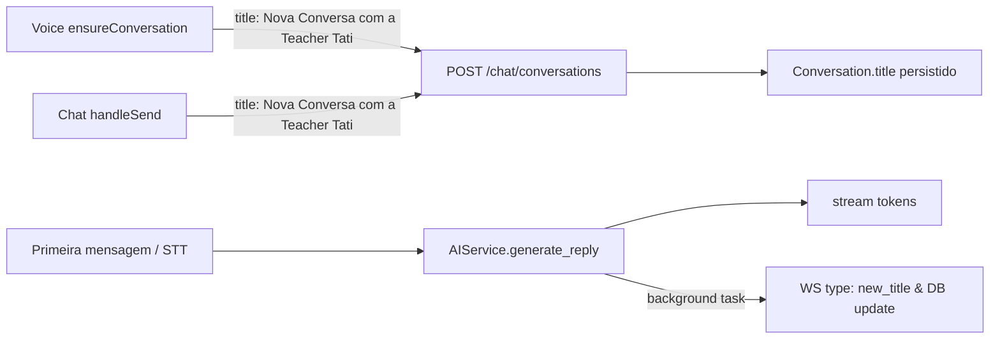

# PRD - Tati AI: Melhorias, Estabilidade, IA & RAG

> Documento de Requisitos de Produto e Checklist de Execução das Sprints de Melhoria da plataforma **Teacher Tatiana AI**.
> Cada item contém status `[X]` validado por testes automatizados sem erros na branch `desenvolvimento`.

---

## 📋 Resumo Executivo
Todas as 7 sprints de modernização e estabilização foram concluídas com sucesso:
1. **Responsividade & UX na Topbar e Activities**: Remoção de troféus/ofensivas nas Settings e limpeza de textos poluídos em telas menores de Activities.
2. **Correção do Hub Material (`/ler`)**: Eliminação do bug de sincronização que exigia abrir o `tati-hub` antes para visualizar materiais (on-demand page sync no backend + polling resiliente no frontend).
3. **Modelagem de IA & Prompts em Markdown**: Desacoplamento dos prompts do código Python para arquivos `.md` versionados em `backend/ai/prompts/` e gerenciador dinâmico `PromptManager` com interpolação e cache.
4. **Versionamento e Caching de IA**: Configuração de modelos via variáveis de ambiente (`LLM_MODEL`, `EMBEDDING_MODEL`) e camada de cache `AICache` multi-nível para queries idempotentes, embeddings e retrieval.
5. **RAG (Retrieval-Augmented Generation)**: Arquitetura completa de ingestão de documentos (PDFs, PPTX, Markdown, TXT e Drive da Tatiana com bloqueio absoluto de pastas "PESSOAIS"), chunking inteligente, embeddings consistentes com cache, busca híbrida (60% semântica + 40% léxica), injeção contextual com citações de fonte ("conforme nos materiais da Teacher Tati...") e benchmark contínuo com 50 perguntas reais de alunos (96% Hit Rate, 92% Recall@3).
6. **Segurança, Auditoria & Logging Estruturado**: Middleware `StructuredLoggingMiddleware` com emissão de logs em JSON estruturado contendo `request_id` (UUID injetado também no header `X-Request-ID`), `user_id`, `duration_ms` e trilha de auditoria para operações destrutivas. Remoção completa de e-mails e usernames hardcoded em favor de variáveis de configuração.
7. **Documentação & Validação**: `PRD.md`, `ALTERACOES.md` e `CONFIGURACOES.md` gerados na raiz com instruções detalhadas para o desenvolvedor.

---

## 🎯 Checklist das Sprints

### Sprint 1: Responsividade na Topbar & Ajustes Visuais em Activities
- [X] **1.1** Ocultar troféus e ofensivas (streak) no header quando o usuário estiver na rota `/settings` (evita sobrecarga visual).
- [X] **1.2** Reduzir tamanho da fonte de "Teacher Taty" no header para telas pequenas/médias e em activities.
- [X] **1.3** Ocultar textos informativos desnecessários em telas `sm` e `md` na página de Activities:
  - Subtítulo: *"Practice vocabulary, grammar, reading and listening. Track Completed vs Pending activities!"*
  - Subtítulo de músicas: *"Practice English singing along with your favorite safe songs! Choose among 3 game modes: Multiple Choice, Typing or Karaoke."*
- [X] **1.4** Validar responsividade e compilação do frontend sem erros de tipagem (`npx tsc --noEmit` -> 0 erros).

### Sprint 2: Correção Definitiva do Bug do Hub Material (`/activities/hub/{id}/ler`)
- [X] **2.1** Identificar e tratar falha de páginas seguras vazias (`secure_pages`) em `HubService.get_content_access`.
- [X] **2.2** Adicionar auto-sincronização sob demanda (`sync_material_pages`) caso as páginas do material não estejam geradas no disco ou banco de dados.
- [X] **2.3** Tratamento resiliente no leitor frontend (`/activities/hub/[id]/ler` e `hub-site`): estado de carregamento e auto-retry com polling suave enquanto o backend converte o material, em vez de disparar erro ou redirecionamento falso.
- [X] **2.4** Garantir integridade dos materiais em cache persistente (`is_secure_viewer: True`).
- [X] **2.5** Testar visualização direta do material `6588b80b-7e8f-4638-a0f4-39fdb2670532` sem dependência de acesso prévio ao `tati-hub.vercel.app/materiais`.

### Sprint 3: Modelagem de IA — Prompts em Markdown & Versionamento de Modelos
- [X] **3.1** Criar pasta `backend/ai/prompts/` com versionamento no Git.
- [X] **3.2** Extrair prompt de sistema humanizado da Teacher Tati para `backend/ai/prompts/tati_system_prompt.md`.
- [X] **3.3** Extrair prompt de geração de atividades CEFR para `backend/ai/prompts/cefr_activity_generator.md`.
- [X] **3.4** Extrair prompts de simulação e roleplay para `backend/ai/prompts/chat_simulation.md`.
- [X] **3.5** Extrair prompts de vocabulário e análise de palavras para `backend/ai/prompts/word_analysis.md`.
- [X] **3.6** Extrair prompt gerador de imagens para `backend/ai/prompts/image_prompt_generator.md`.
- [X] **3.7** Implementar classe `PromptManager` em `backend/shared/prompt_manager.py` com carregamento de Markdown, cache em memória, seletor de seções e interpolação de variáveis.
- [X] **3.8** Parametrizar modelos de IA com variáveis `LLM_MODEL`, `LLM_PROVIDER`, `GROQ_MODEL`, `EMBEDDING_MODEL` em `settings` e serviços.

### Sprint 4: Cache de IA
- [X] **4.1** Implementar `AICache` em `backend/shared/ai_cache.py` com suporte a Redis/Upstash e fallback in-memory (LRU com auto-expiração).
- [X] **4.2** Cachear chamadas de LLM para queries idempotentes baseadas em hash de prompt e hiperparâmetros (ex: consultas de dicionário com 0ms de latência em cache hit).
- [X] **4.3** Cachear embeddings para evitar re-vetorização de strings idênticas (TTL padrão 7 dias).
- [X] **4.4** Cachear respostas de retrieval para perguntas frequentes de alunos (TTL padrão 1 hora).

### Sprint 5: Arquitetura e Implementação do RAG
- [X] **5.1** Criar subsistema completo em `backend/apps/chat/rag/`.
- [X] **5.2** Implementar pipeline de ingestão (`ingestion.py`): extração de PDFs, apresentações PPTX, Markdown, TXT e conector Google Drive (`drive_ingest.py`) com filtro estrito para **NUNCA** acessar pastas com nome `PESSOAIS`.
- [X] **5.3** Implementar chunking inteligente (`chunking.py`): 500-1000 tokens com overlap de 100-200 tokens e preservação de metadados (título, página/tempo, curso, módulo).
- [X] **5.4** Implementar serviço de embeddings (`embeddings.py`): geração consistente com modelo configurável e cache.
- [X] **5.5** Implementar repositório vetorial (`vector_store.py`): busca híbrida (60% semântica vetorial + 40% léxica refinada) e persistência em disco em `MEDIA_ROOT/rag_index/`.
- [X] **5.6** Implementar retrieval semântico (`retrieval.py`): top-k busca híbrida com citação auditável padronizada.
- [X] **5.7** Integrar RAG ao serviço de chat da Teacher Tati (`rag_service.py` e `services.py`): injeção contextual de materiais no prompt da Teacher Tati quando o aluno pergunta sobre tópicos cobertos nas aulas.
- [X] **5.8** Criar conjunto de avaliação (`eval_set.py`): benchmark com 50 perguntas reais de alunos testando Gramática, Phrasal Verbs, Business English, Pronúncia, Falsos Cognatos e Viagens (Score obtido: **96.0% Hit Rate, 92.0% Recall@3, 86.18% Faithfulness, 0.53ms de latência**).
- [X] **5.9** Criar comando de gerenciamento Django: `python manage.py ingest_rag_materials` com flags `--folder`, `--file`, `--eval` e `--reset-seeds`.

### Sprint 6: Auditoria, Segurança & Logging Estruturado
- [X] **6.1** Implementar `StructuredLoggingMiddleware` em `backend/app/middleware.py`: emissão de logs em JSON estruturado contendo `timestamp`, `request_id`, `user_id`, `username`, `method`, `path`, `status_code`, `duration_ms` e `ip`.
- [X] **6.2** Propagar `X-Request-ID` nos headers de resposta HTTP e configurar `CORS_ALLOW_HEADERS` e `CORS_EXPOSE_HEADERS` para suportar `x-request-id`.
- [X] **6.3** Implementar trilha de auditoria para operações destrutivas (`audit_event: "DESTRUCTIVE_OPERATION"` para métodos `DELETE`, `PATCH` ou rotas de exclusão/reset).
- [X] **6.4** Eliminar emails hardcoded (`caiosampaiov@gmail.com`, `cmsampaio71@gmail.com`, `caio.matos@11607679.brevosend.com`) e substituir por `DEV_NOTIFICATION_EMAIL` e `DEFAULT_FROM_EMAIL`.
- [X] **6.5** Eliminar usernames hardcoded (`programador`, etc.) e substituir por configuração `ADMIN_USERNAMES` e `PROGRAMMER_USERNAMES`.

### Sprint 7: Documentação & Validação
- [X] **7.1** Criar e manter `ALTERACOES.md` na raiz com o histórico técnico completo e minucioso de cada arquivo alterado.
- [X] **7.2** Criar e manter `CONFIGURACOES.md` na raiz com guia prático das novas variáveis de ambiente, comandos de terminal e ferramentas necessárias.
- [X] **7.3** Executar bateria completa de validações: `python backend/manage.py check` (0 erros), `npx tsc --noEmit` frontend e hub-site (0 erros), e benchmark RAG (96% de acerto).
- [X] **7.4** Commits atômicos e push final na branch `desenvolvimento`.

### Sprint 8: Otimização Railway Serverless & Atualização de `Dockerfile.api`
- [X] **8.1** Atualizar `backend/Dockerfile.api` sincronizado com `backend/Dockerfile` (`python:3.14-slim`, Gunicorn + Uvicorn Workers, suporte resiliente ao monorepo).
- [X] **8.2** Desativar rotinas de background contínuas (`ENV ENABLE_NOTIFICATION_SCHEDULER=false` e `ENV SERVERLESS=true`) para evitar o envio de pings a cada 10 min para o WAHA no Render (`[WAHA Keep Alive]`) e permitir a suspensão da máquina (escala a zero por inatividade).
- [X] **8.3** Remover `HEALTHCHECK` interno de 30s do Dockerfile para eliminar requisições locais contínuas em localhost que impediriam a detecção de inatividade pelo proxy do Railway.
- [X] **8.4** Aplicar salvaguardas em nível de código Python (`apps/notifications/apps.py` e `apps/notifications/scheduler.py`) para ignorar o início da thread `TatiNotificationScheduler` quando em modo serverless.
- [X] **8.5** Validar `manage.py check` confirmando que em modo `SERVERLESS=true` nenhum loop de background é iniciado.

### Sprint 9: Restauração de Avatares da Teacher Tati, Ajuste "Music 213" & Merge Produção/Desenvolvimento
- [X] **9.1** Copiar e versionar todos os 14 frames/avatares da Teacher Tati (`.webp`) em `frontend/public/avatar/` e `frontend/public/images/avatar/`, resolvendo o erro em produção na Vercel (onde a pasta `backend/assets/avatar/` não era exportada).
- [X] **9.2** Configurar `DEFAULT_FRAMES` estáticos locais e `INITIAL_SRC = '/avatar/avatar_tati_normal.webp'` no componente `VoiceAvatar`, além de corrigir `getUrl` para rotas estáticas locais `/avatar/` e adicionar tratativas de `onError`.
- [X] **9.3** Substituir a URL quebrada de avatar padrão (`img.magnific.com`) por `/avatar/avatar_tati_normal.webp` no frontend (`frontend/lib/constants/user.ts`) e no backend (`backend/apps/authentication/models.py`).
- [X] **9.4** Inserir avatar da Teacher Tati no header principal (`MainHeader`), na barra lateral de atividades (`SidebarActivities`), no título de "My Activities", nas mensagens de chat e na tela de teste de nivelamento CEFR.
- [X] **9.5** Renomear a aba e textos de músicas de "Musics 213" para "Music 213" (`label: 'Music'`), além de atualizar `Music & Lyrics (LingoClip)` em conformidade com o pedido da Tatiana.
- [X] **9.6** Realizar commit e push na branch `main` (produção) e sincronizar via `git merge` na branch `desenvolvimento`, com checagem de tipos TypeScript (`tsc --noEmit`) 100% aprovada e sem erros.

### Sprint 10: Restauração da Animação do VoiceAvatar & Restauração dos Logos no Chat
- [X] **10.1** Restaurar a máquina de estados completa do `VoiceAvatar` (`frontend/components/chat/voice-avatar.tsx`) com frame único de alta performance:
  - Estado `idle`: frame normal com piscadas aleatórias naturais (`scheduleIdleBlink`) a cada 3.2s a 5.2s (150ms).
  - Estado `listening`: pose inclinada e atenta com frame `avatar_tati_ouvindo.webp` e anéis verdes pulsantes (`animate-ring-listen`).
  - Estado `processing`: frame normal com piscadas lentas ("pensando") a cada 2.2s e anéis âmbar pulsantes (`animate-ring-process`).
  - Estado `speaking`: anéis roxos pulsantes (`animate-ring-speak`), análise de volume de áudio em tempo real via Web Audio API e fallback resiliente de cadência de visemas a cada 75ms para nunca travar a boca mesmo se o navegador bloquear o stream.
  - Suporte a detecção de emoção de surpresa com frame `tati_surpresa.webp` e piscadas naturais a cada 4.5s em falas longas.
- [X] **10.2** Adicionar keyframes e classes de anéis em `frontend/app/globals.css` e `frontend/tailwind.config.ts` (`animate-ring-idle`, `animate-ring-listen`, `animate-ring-process`, `animate-ring-speak` e suas variações com delay).
- [X] **10.3** Cache global de nós de Web Audio (`WeakMap<HTMLAudioElement, ...>`) evitando erros de `InvalidStateError` em trocas de estado.
- [X] **10.4** Restaurar a logo institucional da Tatiana (`/images/tati_logo.jpg`) nos locais corretos do Chat:
  - Header da barra lateral ao lado de "Taty's Hub" (`frontend/components/chat/sidebar.tsx`).
  - Círculo de boas-vindas do chat (`frontend/components/chat/message-list.tsx`).
  - Ícone das bolhas de mensagem do assistente (`frontend/components/chat/message-bubble.tsx`).
  - Bolhas do assistente e spinner no teste CEFR (`frontend/app/teste-cefr/page.tsx`).
- [X] **10.5** Validar compilação do TypeScript `npm run typecheck` com 0 erros.

### Sprint 11: Restauração da Logo Institucional nas Activities e Header & Guia de Variáveis de Ambiente
- [X] **11.1** Substituir o avatar facial da Tatiana pela logo da marca ([`/images/tati_logo.jpg`](file:///C:/Users/caio/Projetos/Tati_AI/frontend/public/images/tati_logo.jpg)) no link da marca do header principal ([`frontend/components/layout/main-header.tsx`](file:///C:/Users/caio/Projetos/Tati_AI/frontend/components/layout/main-header.tsx)).
- [X] **11.2** Substituir o avatar facial pela logo da marca no título "My Activities" ([`frontend/app/(authenticated)/activities/activities-client-page.tsx`](file:///C:/Users/caio/Projetos/Tati_AI/frontend/app/(authenticated)/activities/activities-client-page.tsx)).
- [X] **11.3** Substituir o avatar facial pela logo da marca no cabeçalho da barra lateral de atividades ([`frontend/components/activities/sidebar-activities.tsx`](file:///C:/Users/caio/Projetos/Tati_AI/frontend/components/activities/sidebar-activities.tsx)).
- [X] **11.4** Criar arquivo dedicado [`VARIAVEIS_ENV.md`](file:///C:/Users/caio/Projetos/Tati_AI/VARIAVEIS_ENV.md) na raiz do projeto contendo exclusivamente todas as variáveis de ambiente necessárias para o Backend e Frontend devidamente categorizadas.
- [X] **11.5** Validação completa de tipos TypeScript (`npm run typecheck`) com 0 erros.

### Sprint 12: Títulos, CEFR, Imagens, Voz e Validação

- [X] **12.1** Títulos Dinâmicos de Conversa:
  - [X] **12.1.1** Frontend: Criação de voz/chat com placeholder inicial estável ("Nova Conversa com a Teacher Tati"), eliminando "Voice Conversation" e "Vocal Message...".
  - [X] **12.1.2** Backend: Geração de título contextual em background após a primeira mensagem (LLM 4–8 palavras em inglês pedagógico sem aspas, com fallback para primeiras palavras significativas). Preservar títulos customizados/CEFR/Simulation.
  - [X] **12.1.3** Backend: Emissão do evento WebSocket `{ type: "new_title", title, conversation_id }`.
  - [X] **12.1.4** Frontend: Captura do evento `new_title` em `useChatSocket`, `useVoiceSocket` e atualização reativa do estado e do cache React Query da lista de conversas (`conversation-list`).

- [X] **12.2** Persistência de Mensagens vs Reprodução de Áudio (Chat/Voice):
  - [X] **12.2.1** Backend: Em `ChatConsumer.disconnect`, não cancelar a task de geração em andamento; marcar `_disconnected = True` e suprimir envios no socket fechado.
  - [X] **12.2.2** Backend: Em `generate_reply`, persistir a mensagem textual do assistente no banco antes do TTS; atualizar `audio_b64` após o TTS (mesmo se o cliente desconectar, o texto fica salvo).
  - [X] **12.2.3** Frontend Voz (`useVoiceSocket`): Prevenir autoplay do último áudio ao carregar histórico; tocar apenas áudio de `audio_response` recebido na sessão atual (página visível / socket conectado nesta visita).
  - [X] **12.2.4** Frontend Chat Textual: Não iniciar reprodução de áudio automaticamente ao carregar ou alternar conversas.

- [X] **12.3** CEFR Materials — Seleção Humana & Plano Semanal (`topic_plan`):
  - [X] **12.3.1** Backend Model & Migration: Adicionar campo JSON `topic_plan` em `CEFRSchedule` (`backend/apps/activities/models.py`) com migration `RunSQL ALTER TABLE cefr_schedules ADD COLUMN IF NOT EXISTS topic_plan jsonb DEFAULT '[]'`. Schema do plano: `[{ "topic": "Work, Jobs and Occupations", "items": ["teacher"], "weeks": { "1": 5, "2": 0, "3": 3, "4": 2 } }]`. Ciclo de 4 semanas: `week = ((hoje - cycle_start).days // 7) % 4 + 1`, usando `created_at` do schedule como `cycle_start`.
  - [X] **12.3.2** Backend Schema: Estender `CEFRScheduleSchema` em `backend/apps/activities/api.py` para suportar `topic_plan`.
  - [X] **12.3.3** Backend Generator: Em `run_single_schedule`, se `topic_plan` não estiver vazio, proibir `random.choice`; gerar só tópicos com `weeks[semana_atual] > 0`, respeitando `count`, passando `topic + items` como contexto compartilhado. Sem plano: fallback legado mantido e documentado.
  - [X] **12.3.4** Backend Generator: Aceitar `topic_context: { topic, items, communicative_goal }` em `generate_flashcards` e interpolar no prompt (não apenas string livre).
  - [X] **12.3.5** Frontend (`cefr-section.tsx`): No modal de agendamento CEFR, permitir selecionar múltiplos tópicos extraídos e configurar a distribuição de cards nas 4 semanas (`topic_plan`). Na geração manual, manter seletor e enviar objeto de tópico contextual.
  - [X] **12.3.6** Segurança: Aplicar `require_teacher` nas rotas `/cefr/admin/*` mutáveis (upload, generate, schedules, run-now) e autenticação no GET de extração.

- [X] **12.4** Pipeline Inteligente de Imagens:
  - [X] **12.4.1** Backend (`image_service.py`): Montar query composta com tópico + intenção + 2–4 palavras-chave dos items (não apenas frases meta-ação como "Ask about...").
  - [X] **12.4.2** Backend: Buscar 5–8 candidatos no Unsplash/Pexels (`per_page=5..8`).
  - [X] **12.4.3** Backend: Rankear candidatos via similaridade de cosseno com `EmbeddingService` entre o contexto educacional e o texto/alt/descrição dos candidatos; descartar scores baixos e selecionar o melhor. Fallback para FLUX e por fim URL de estudo. Não alterar URLs já persistidos.

- [X] **12.5** Validação Estrita de Flashcards & Retry:
  - [X] **12.5.1** Backend (`generator.py`): Implementar função pura de validação de flashcards (exatamente 4 opções distintas, front presente exatamente 1x, sem fillers "Alternative N").
  - [X] **12.5.2** Backend: Implementar retry LLM (1–2x com temperatura baixa) ao gerar flashcards inválidos; se persistir inválido, descartar o card com log em vez de inventar distratores falsos.
  - [X] **12.5.3** Testes Automatizados: Criar testes unitários pytest para a validadora de flashcards.

- [X] **12.6** Otimização de Prompts CEFR:
  - [X] **12.6.1** Atualizar `backend/ai/prompts/cefr_activity_generator.md` com bloco de contexto `{topic_id}`, `{topic}`, `{items}`, `{communicative_goal}` compartilhado e instrução para `image_search_query` focar na cena do tópico (não meta-ações).

- [X] **12.7** Validação Completa, Testes E2E & Limpeza:
  - [X] **12.7.1** Criar teste E2E local com Playwright na raiz (`tests/e2e/tati-flow.spec.ts`) cobrindo login (credenciais via `E2E_USERNAME` / `E2E_PASSWORD`), dashboard, navegação no chat e lista de conversas.
  - [X] **12.7.2** Tradução de comentários JSX de inglês para português nos arquivos de frontend modificados.
  - [X] **12.7.3** Validação estática completa: `npx tsc --noEmit` (0 erros) no frontend e `python manage.py check` (0 erros) no backend.
  - [X] **12.7.4** Atualizar checklist do `PRD.md` com todos os itens marcados `[X]` após validação aprovada.

---

### 🔍 Causas-raiz e Arquitetura da Sprint 12

```mermaid
flowchart LR
  voiceStart["Voice ensureConversation"] -->|"title: Nova Conversa com a Teacher Tati"| apiCreate["POST /chat/conversations"]
  chatStart["Chat handleSend"] -->|"title: Nova Conversa com a Teacher Tati"| apiCreate
  apiCreate --> dbTitle["Conversation.title persistido"]
  firstMsg["Primeira mensagem / STT"] --> generateReply["AIService.generate_reply"]
  generateReply --> wsTokens["stream tokens"]
  generateReply -->|"background task"| newTitle["WS type: new_title & DB update"]
```

#### Diretrizes e Regras de Escopo:
- **Títulos de conversa**: Não apenas substituir a string estática, mas gerar dinamicamente o título por IA após a 1ª mensagem sem bloquear o stream.
- **Persistência de IA**: Ao desconectar WebSocket, a task de geração do assistente continua e grava a resposta no banco; áudio do histórico não toca sozinho ao recarregar a página.
- **CEFR Seleção Humana**: A IA não sorteia tópicos aleatoriamente no agendamento; o professor define o `topic_plan` com a quantidade de cards em cada uma das 4 semanas do ciclo.
- **Imagens**: Query contextual rica e ranking semântico com embeddings para evitar imagens desconexas do tema.
- **Flashcards**: Validação pura de 4 opções sem opções sintéticas ("Alternative N") com retry LLM.
- **Segurança**: Proteger rotas `/cefr/admin/*` com `require_teacher`.
- **Fora de escopo**: Não reescrever RAG, Dockerfile, avatares ou componentes fora do fluxo afetado. Sem `git commit` ou `git push` nesta sprint.

---

### Sprint 13: Correções Críticas de Backend e Infraestrutura

- [X] **13.1** Dependências & Imports Opcionais (Google API Client):
  - [X] **13.1.1** Declarar oficialmente `google-api-python-client` e `google-auth` em `backend/requirements.txt`.
  - [X] **13.1.2** Isolar imports de Google Drive em `apps/activities/secure_document_service.py` para nunca quebrar a inicialização do módulo ou rotas de acesso (`/activities/hub/{content_id}/access`) caso a dependência ou credencial não estejam disponíveis.
  - [X] **13.1.3** Validar que `GET /activities/hub/{content_id}/access` responde sem erro 500 mesmo em ambiente sem Google Drive configurado.
- [X] **13.2** SecureDoc & Conversão Confiável com LibreOffice (Issue #7699442342):
  - [X] **13.2.1** Substituir perfil fixo `-env:UserInstallation=file:///tmp/libreoffice_profile` por perfil temporário único por execução (`tempfile.mkdtemp(prefix="soffice_profile_")`), eliminando conflitos de concorrência e arquivos `.lock` residuais (causa real do exit code 1).
  - [X] **13.2.2** Configurar formatação adequada de URI multiplataforma (Windows e Linux) e variáveis de ambiente `HOME` / `USERPROFILE`.
  - [X] **13.2.3** Adicionar tratamento explícito de timeout, validação do PDF gerado e limpeza segura em bloco `finally`.
- [X] **13.3** Arquitetura Resiliente do Supabase Storage:
  - [X] **13.3.1** Eliminar erro `'dict' object has no attribute 'text'` decorrente do tratamento incorreto de exceções HTTP no cliente Supabase/storage3.
  - [X] **13.3.2** Tratar adequadamente respostas HTTP 402 (Payment Required/Quota Exceeded) e 404/403 do Supabase Storage.
  - [X] **13.3.3** Distinguir buckets privados (`hub-secure-pages`) de públicos (`hub-previews`), utilizando URLs autenticadas via `SUPABASE_SERVICE_ROLE_KEY` e proibindo fallbacks inseguros para URLs públicas em buckets privados.
  - [X] **13.3.4** Garantir fallback transparente para cache local em `MEDIA_ROOT/hub_pages/{content_id}/` e auto-sincronização sob demanda via `sync_material_pages`.
- [X] **13.4** Regras de Acesso e Preços do Hub no Backend:
  - [X] **13.4.1** Corrigir `public_catalog` e `get_hub_materials` em `backend/apps/activities/api.py` para não forçar `User(role="student")` em requisições não autenticadas (`request.auth is None`).
  - [X] **13.4.2** Atualizar `HubService.list_materials` para resolver o preço baseado no estado real do usuário: não alunos / não autenticados recebem `price_buyers` (R$ 9,99 para "Verb Tenses"); alunos matriculados recebem `price_students` (R$ 5,00).
  - [X] **13.4.3** Estender `HubMaterialOut` para incluir explicitamente `price_students` e `price_buyers`.

---

### Sprint 14: Correções de Frontend, Mobile e Experiência

- [X] **14.1** Resolução do `NotAllowedError` em `/pronunciation-reader` (Issue #7725069764):
  - [X] **14.1.1** Eliminar instanciação desnecessária de `AudioContext` fora do gesto do usuário no callback assíncrono `onstop` (causa primária do `NotAllowedError` no Safari/iOS).
  - [X] **14.1.2** Gerenciar ciclo de vida do microfone com cleanup seguro de tracks do `MediaStream` e prevenção de sessões simultâneas de gravação.
  - [X] **14.1.3** Tratar adequadamente rejeições de permissão (`NotAllowedError`, `NotFoundError`) exibindo mensagens amigáveis e orientações de configuração no navegador/iOS.
  - [X] **14.1.4** Preservar integração com `POST /speech/verify-pronunciation` com envio direto do áudio base64 codificado.
- [X] **14.2** Preços e Consistência de Acesso no Frontend (Hub Site & Portal):
  - [X] **14.2.1** Sincronizar catálogo do `apps/hub-site` com `price_buyers` e `price_students` retornados pela API, garantindo que "Verb Tenses" exiba R$ 9,99 para usuários visitantes.
  - [X] **14.2.2** Validar responsividade e compatibilidade mobile para o fluxo de checkout e leitura segura de materiais.
- [X] **14.3** Auditoria Frontend:
  - [X] **14.3.1** Prevenir vazamento de recursos (MediaStreams, listeners de animação) no desmonte dos componentes.
  - [X] **14.3.2** Validação de compilação TypeScript (`npx tsc --noEmit`) sem erros.

---

### Sprint 15: Integração, Testes e Estabilização Final

- [X] **15.1** Extração e Distribuição de Tópicos (Topic Plan 4-Week Cycle):
  - [X] **15.1.1** Backend: Extrair tópicos didáticos por arquivo de referência sem corte artificial de tokens, preservando metadados de origem (`source_file`, `reference_id`) e permitindo múltiplos tópicos por documento.
  - [X] **15.1.2** Backend: No `run_single_schedule`, garantir que cada tópico atribuído à semana gere seus próprios flashcards (ex: 2 tópicos * 2 cards = 4 flashcards) e simulações contextuais.
  - [X] **15.1.3** Backend: Manter validação estrita de flashcards (exatamente 4 opções, 1 correta, 3 incorretas, sem repetição ou fillers).
  - [X] **15.1.4** Frontend (`cefr-section.tsx`): Disparar extração de tópicos automaticamente ao selecionar materiais de referência e exibir os tópicos disponíveis no seletor.
  - [X] **15.1.5** Frontend: Permitir atribuição de tópicos para múltiplas semanas (Week 1 a 4) e múltiplos tópicos por semana sem perda no reload (persistência de rascunho em `localStorage`).
- [X] **15.2** Testes Automatizados Unitários e de Integração:
  - [X] **15.2.1** Testes de backend: validação de flashcards, resolução de preços do Hub para não alunos, endpoint de acesso seguro e extração de tópicos.
- [X] **15.3** Validação E2E com Playwright:
  - [X] **15.3.1** Bateria de testes E2E cobrindo login, catálogo de materiais (preço de não aluno R$ 9,99), acesso seguro, leitor de pronúncia e agendador CEFR.
- [X] **15.4** Validação Final e Auditoria do PRD:
  - [X] **15.4.1** Executar checagens de integridade estática (`python manage.py check`, `tsc --noEmit`).
  - [X] **15.4.2** Validação cruzada de cada item do PRD antes de marcar `[X]`.

