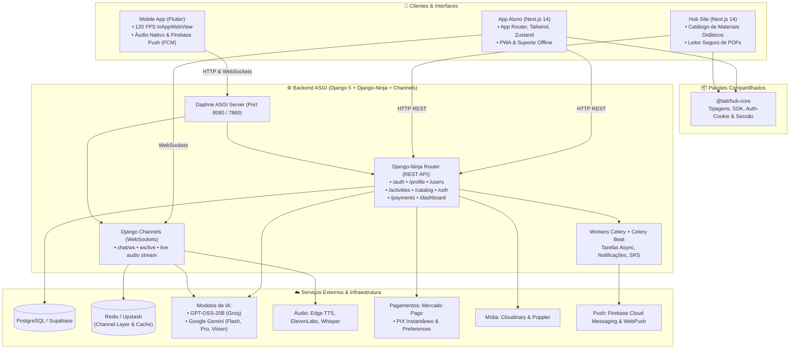
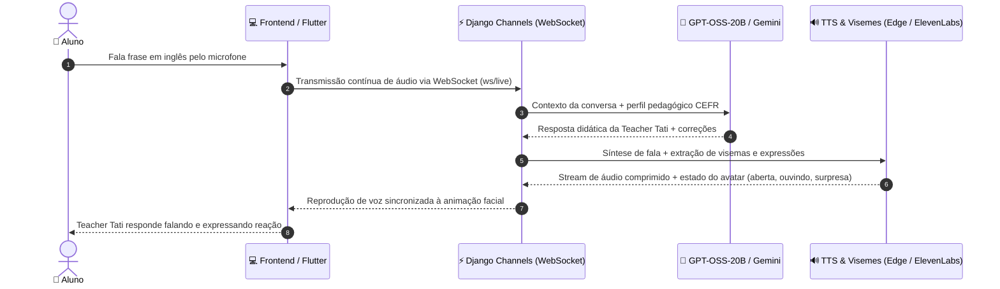

<div align="center">

# 🤖 Teacher Tati AI (Taty's English) 📚
### *Plataforma Inteligente de Ensino de Inglês com IA Conversacional 24/7, Avatar Reativo e Ecossistema Multiplataforma*

<br />

<p align="center">
  
</p>

[](https://nextjs.org/)
[](https://reactjs.org/)
[](https://www.typescriptlang.org/)
[](https://tailwindcss.com/)
[](https://www.djangoproject.com/)
[](https://django-ninja.dev/)
[](https://channels.readthedocs.io/)
[](https://github.com/django/daphne)
[](https://flutter.dev/)
[](https://groq.com/)
[](https://ai.google.dev/)
[](https://www.mercadopago.com.br/developers)
[](https://supabase.com/)
[](https://upstash.com/)
[](https://docs.celeryq.dev/)

<br />

**[Visão Geral](#-visão-geral)** •
**[Preview & Funcionalidades](#-preview--funcionalidades-chave)** •
**[Arquitetura](#%EF%B8%8F-arquitetura-do-sistema)** •
**[Estrutura do Monorepo](#-estrutura-do-monorepo)** •
**[Como Começar](#-como-começar-desenvolvimento-local)** •
**[Variáveis de Ambiente](#-variáveis-de-ambiente)** •
**[Deploy](#-deploy--produção)**

---

</div>

## 📖 Visão Geral

O **Teacher Tati AI** é um ecossistema educacional de última geração voltado ao aprendizado prático, dinâmico e imersivo da língua inglesa. A plataforma reúne uma tutora virtual baseada em modelos de inteligência artificial de ponta — liderados por **GPT-OSS-20B** (via Groq) para diálogos velozes e pelo poder multimodal do **Google Gemini** (Gemini 1.5 Flash/Pro e Gemini Vision) — combinada à síntese de voz natural (Edge TTS / ElevenLabs) e a um **avatar animado reativo**, permitindo conversações realistas com sincronização labial e expressões em tempo real.

O projeto é mantido em um **Monorepo gerenciado com NPM Workspaces**, conectando:
- **Backend ASGI:** Construído com **Django 5**, **Django-Ninja** (para endpoints RESTful de alta tipagem e velocidade), **Django Channels** (para WebSockets bidirecionais de chat e voz) e servidor **Daphne**.
- **Frontend do Aluno:** Aplicação moderna em **Next.js 14 (App Router)** com suporte a PWA, modo offline e design fluido com Tailwind CSS.
- **Hub de Materiais (Hub Site):** Portal Next.js 14 dedicado à venda, catálogo e leitura protegida de materiais didáticos.
- **Mobile Nativo (Flutter):** App mobile Flutter com 120 FPS, gravação nativa de microfone e notificações push via Firebase (FCM).
- **Pacote Compartilhado (`@tati/hub-core`):** SDK com tipagens, gerenciamento de sessão/cookies e contratos de API unificados.
- **Pagamentos Integrados:** Checkout transparente e geração de PIX dinâmico com confirmação instantânea via **Mercado Pago**.

---

## 📸 Preview & Funcionalidades Chave

### 1. Avatar Reativo & Chat de Voz em Tempo Real
A IA reage visual e auditivamente conforme a fala do aluno, comutando expressões faciais em tempo real de acordo com o estado da conversa:

| Expressão Padrão | Ouvindo o Aluno | Falando / Ensinando | Reação / Feedback |
| :---: | :---: | :---: | :---: |
|  |  |  |  |
| **Pronta para interagir** | **Microfone ativo (STT)** | **Síntese de áudio (TTS)** | **Correção e incentivo** |

* 🎙️ **Full Voice Mode via Django Channels:** Fluxo de áudio bidirecional e contínuo via WebSockets (`ws/live` e `chat/ws`), integrando Whisper (STT) e Edge TTS / ElevenLabs.
* 🗣️ **Pronunciation Reader & Challenge:** Treinamento fonético com pontuação de precisão de pronúncia palavra por palavra.

---

### 2. Destaques da Plataforma

* 🧠 **Pipeline de IA com GPT-OSS-20B & Gemini:**
  * **GPT-OSS-20B:** Modelo principal para conversação didática instantânea com baixíssima latência (Groq).
  * **Google Gemini (1.5 Flash / 2.0 Flash / 1.5 Pro):** Geração inteligente de questionários, nivelamento pedagógico, fallback automático e **Gemini Vision** para leitura e OCR de documentos/apostilas.
* 💳 **Pagamentos Nativos com Mercado Pago:**
  * Cobranças via **PIX instantâneo** com QR Code dinâmico e código Copia e Cola.
  * **Checkout Preferences** para pagamentos com cartão de crédito ou boleto.
  * Processamento de **Webhooks** com liberação em tempo real de assinaturas e materiais didáticos.
* 🎯 **Diagnóstico e Alinhamento CEFR (A1 a B2):** Prova de diagnóstico inicial e nivelamento contínuo das respostas do aluno.
* 🗂️ **Sistema SRS (Spaced Repetition System):** Algoritmo de repetição espaçada para memorização eficiente de vocabulário.
* 🏆 **Gamificação Completa:** Pontuação de experiência (XP), ofensivas diárias (*streaks*), troféus e ranking competitivo semanal.
* 🎧 **Podcasts Interativos:** Recomendações e exercícios de áudio baseados no histórico de aprendizado.
* 📚 **Hub de Materiais & Leitor Seguro:** Catálogo de apostilas com leitor seguro de PDF contra cópia e download não autorizado.
* 📱 **Ecossistema Multiplataforma:** Web PWA instalável + App Nativo Flutter com áudio nativo e push notifications via Firebase.

---

## 🏗️ Arquitetura do Sistema

### Diagrama de Módulos & Integrações



---

### Fluxo de Conversação de Voz em Tempo Real



---

## 📂 Estrutura do Monorepo

```text
Tati_AI/
├── apps/
│   └── hub-site/                # Portal público de catálogo e leitura de apostilas (Next.js 14)
├── packages/
│   └── hub-core/                # SDK TypeScript, tipagens unificadas e controle de sessão
├── frontend/                    # Aplicação web principal do aluno (Next.js 14 + App Router + PWA)
│   ├── app/
│   │   ├── (authenticated)/     # Rotas com autenticação: chat, voice, flashcards, progresso, etc.
│   │   └── (public)/            # Rotas públicas: login, recuperação de senha
│   ├── components/              # Componentes de UI, chat em tempo real, dashboard e gráficos
│   ├── hooks/                   # Hooks customizados (useAuth, useChatSocket, useVoiceSocket)
│   └── public/                  # Manifesto PWA, service worker, imagens e ícones
├── backend/                     # API principal (Django 5 + Django-Ninja + Channels ASGI)
│   ├── app/                     # Configuração Django, ASGI (ProtocolTypeRouter), Daphne e Celery
│   ├── apps/                    # Módulos de domínio desacoplados:
│   │   ├── activities/          # Quizzes, flashcards, podcasts e exercícios
│   │   ├── authentication/      # JWT, Google OAuth e segurança de rotas
│   │   ├── chat/                # Consumers Django Channels, GPT-OSS-20B, Gemini e áudio
│   │   ├── dashboard/           # Métricas do aluno, estatísticas e rankings
│   │   ├── notifications/       # Push notifications, WebPush e e-mails
│   │   ├── payments/            # Integração com Mercado Pago (PIX, preferences e webhooks)
│   │   └── users/               # Perfis, XP, streaks, níveis CEFR e avatares
│   ├── assets/                  # Imagens e frames visuais da personagem Teacher Tati
│   ├── manage.py                # Utilitário administrativo do Django
│   └── requirements.txt         # Dependências Python (Django, Ninja, Channels, Daphne, etc.)
├── mobile/                      # Aplicativo mobile nativo em Flutter (Android & iOS)
│   ├── lib/                     # Código Dart com InAppWebView e gravação de áudio nativa
│   └── android/ & ios/          # Configurações de plataforma e Firebase Cloud Messaging
├── docs/                        # Documentação técnica e guias de arquitetura
├── docker-compose.yml           # Orquestração de containers (PostgreSQL, Redis, Backend, Frontend)
└── package.json                 # Configuração raiz do NPM Workspaces
```

---

## 🚀 Como Começar (Desenvolvimento Local)

### 1. Pré-requisitos
* **Node.js:** versão `18.x` ou superior
* **Python:** versão `3.12` ou superior
* **NPM:** versão `9.x` ou superior
* *(Opcional)* **Docker & Docker Compose** para banco de dados e Redis
* *(Opcional)* **Flutter SDK** para executar o aplicativo mobile

---

### 2. Instalação Geral do Monorepo

Na raiz do projeto, instale as dependências de todos os workspaces:
```bash
npm install
```

---

### 3. Configurando e Rodando o Backend (Django + Channels)

1. Entre na pasta do backend e crie o ambiente virtual:
   ```bash
   cd backend
   python -m venv .venv
   ```

2. Ative o ambiente virtual:
   * **Windows (PowerShell):**
     ```powershell
     .venv\Scripts\Activate.ps1
     ```
   * **Linux / macOS:**
     ```bash
     source .venv/bin/activate
     ```

3. Instale as dependências:
   ```bash
   pip install -r requirements.txt
   ```

4. Crie o arquivo `.env` com as configurações do banco e chaves de API.

5. Execute as migrações do banco de dados:
   ```bash
   python manage.py migrate
   ```

6. Inicie o servidor ASGI com **Daphne** (necessário para suporte a WebSockets via Django Channels):
   ```bash
   daphne -p 8080 app.asgi:application
   # Ou para desenvolvimento básico HTTP:
   python manage.py runserver 8080
   ```
   > 📌 *Swagger / Documentação OpenAPI interativa disponível em:* `http://localhost:8080/docs`

---

### 4. Rodando os Frontends (Web)

A partir da **raiz do projeto**, execute:

* **Iniciar o App Principal do Aluno (Next.js):**
  ```bash
  npm run dev:frontend
  ```
  *Acesso no navegador:* `http://localhost:3000`

* **Iniciar o Hub de Materiais Didáticos (Next.js):**
  ```bash
  npm run dev:hub
  ```
  *Acesso no navegador:* `http://localhost:3001`

---

### 5. Rodando Tarefas Assíncronas (Celery)

Em um terminal separado com o ambiente virtual ativado:
```bash
cd backend
celery -A app.celery:app worker -l info
```
Para agendamento automático de tarefas (Celery Beat):
```bash
celery -A app.celery:app beat -l info
```

---

### 6. Rodando o App Mobile (Flutter)

No emulador ou dispositivo conectado via USB:
```bash
cd mobile
flutter pub get
flutter run
```
Para gerar o arquivo APK de produção:
```bash
flutter build apk --release
```
*Arquivo compilado:* `mobile/build/app/outputs/flutter-apk/app-release.apk`

---

### 7. Executando via Docker Compose

Para rodar todo o ambiente (PostgreSQL, Redis, Backend Django e Frontend Next.js):
```bash
docker-compose up --build -d
```

---

## 🔒 Variáveis de Ambiente

Crie os arquivos `.env` pertinentes tendo como base o `.env.example`. Principais parâmetros:

| Grupo | Variável | Descrição |
| :--- | :--- | :--- |
| **Segurança & Sessão** | `JWT_SECRET_KEY` | Chave criptográfica para geração de tokens JWT |
| | `COOKIE_SECRET` | Chave de segurança para cookies autenticados |
| **Banco de Dados** | `DATABASE_URL` | Conexão PostgreSQL (ex: Supabase Pooler) |
| | `SUPABASE_URL` / `SUPABASE_KEY` | Credenciais da API do Supabase |
| **Modelos de IA** | `GROQ_API_KEY` | Chave da Groq para execução do modelo **GPT-OSS-20B** |
| | `GEMINI_API_KEY` | Chave de API do **Google Gemini** (1.5 Flash, 2.0 Flash, Vision) |
| | `HF_TOKEN_LLAMA` / `HUGGING_FACE_KEY` | Token de fallback para modelos Hugging Face |
| **Pagamentos (Mercado Pago)**| `MP_ACCESS_TOKEN` | Token de acesso de produção ou testes do **Mercado Pago** |
| | `FORWARD_WEBHOOK_URL` | URL de repasse de notificações de webhook (opcional) |
| **Cache & WebSockets** | `REDIS_URL` / `UPSTASH_REDIS_URL` | Conexão Redis para o Channel Layer do Django Channels |
| **Síntese de Áudio** | `ELEVENLABS_API_KEY` | Chave ElevenLabs (opcional, fallback nativo Edge TTS) |
| **Armazenamento de Mídia** | `CLOUDINARY_URL` | URL de conexão Cloudinary para upload de arquivos |
| **Frontend** | `NEXT_PUBLIC_API_URL` | Endpoint da API Backend (ex: `http://localhost:8080`) |

---

## 🧪 Qualidade, Lint e Testes

```bash
# Executar testes do backend Django
python manage.py test

# Validação de tipagem TypeScript nos frontends
npm run typecheck --workspace frontend
npm run typecheck --workspace @tati/hub-site

# Linter do código Python
npm run lint

# Formatação de código Python
npm run format
```

---

## 🚢 Deploy & Produção

* **Backend (Django + Channels ASGI):** Configurado via [Dockerfile](./backend/Dockerfile) multi-stage baseado em Python e servidor ASGI (`app.asgi:application` com Gunicorn + Uvicorn Workers / Daphne), otimizado para **Railway** e **Hugging Face Spaces**.
* **Frontends (Next.js 14):** Prontos para deploy contínuo na **Vercel** com suporte a SSR e Edge caching.
* **App Mobile (Flutter):** Build de release para distribuição direta via APK Android ou publicação nas lojas Google Play e App Store.

---

## 📚 Documentação Adicional

* 🏛️ [Visão Geral de Arquitetura](./docs/architecture.md)
* ⚙️ [Documentação do Backend (Django-Ninja & DDD)](./docs/backend.md)
* 🎨 [Documentação do Frontend (Next.js)](./docs/frontend.md)
* 🗺️ [Mapeamento de Estrutura de Arquivos (PROJECT_STRUCTURE.md)](./PROJECT_STRUCTURE.md)
* 📱 [Guia do Aplicativo Mobile Flutter](./mobile/README.md)

---

<div align="center">
  <sub>Desenvolvido com carinho para transformar o aprendizado de inglês com Inteligência Artificial. ✨</sub>
  <br />
  <sub>© 2026 Teacher Tati AI Team. Todos os direitos reservados.</sub>
</div>